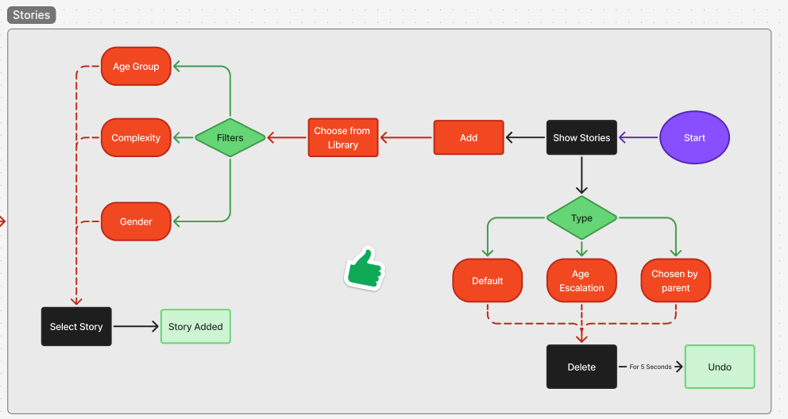
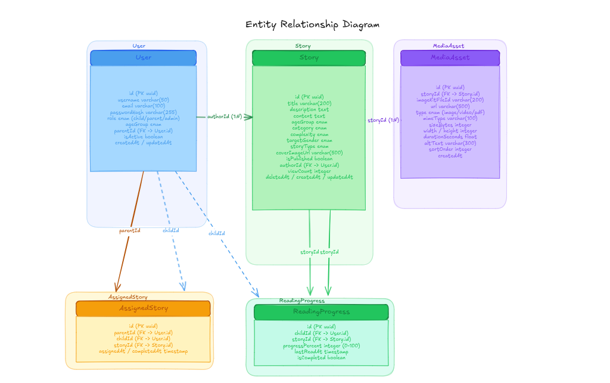
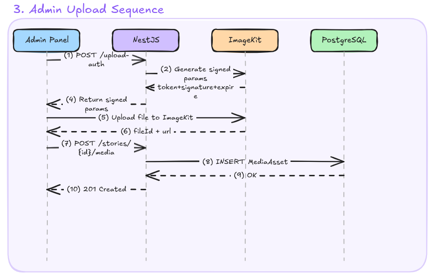
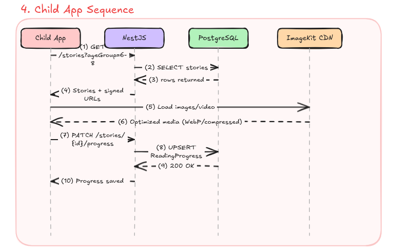

# Stories Feature — Technical Documentation

**Platform:** المنزل الآمن (Safe Home)  
**Stack:** NestJS · TypeORM · ImageKit · PostgreSQL  
**Audience:** Software engineers onboarding to the Stories feature  
**Version:** 2.0  

---

## Table of Contents

1. [Feature Overview](#1-feature-overview)
2. [User Flow Analysis](#2-user-flow-analysis)
3. [Entity Diagram](#3-entity-diagram)
4. [Story Lifecycle](#4-story-lifecycle)
5. [Sequence Diagram — Secure Upload Flow](#5-sequence-diagram--secure-upload-flow)
6. [Efficient Media Upload Strategy](#6-efficient-media-upload-strategy)
7. [Security Protocols](#7-security-protocols)
8. [ImageKit Setup Plan](#8-imagekit-setup-plan)
9. [Upload Policy — Validation & Constraints](#9-upload-policy--validation--constraints)
10. [NestJS Infrastructure Plan](#10-nestjs-infrastructure-plan)
11. [Implementation Roadmap](#11-implementation-roadmap)

---

## 1. Feature Overview

**Feature:** Stories  
**Goal:** Deliver curated, age-appropriate educational content (stories, videos, courses) safely to children on the المنزل الآمن platform.

**Scope:**
- Admins upload stories and associated media (images, videos, PDFs).
- Children browse and read/view stories based on age group, complexity, and type.
- Parents can assign stories manually (Chosen by Parent mode).
- Content must be secure, optimized, and age-appropriate at all times.

**Core Principles:**
- Children **never** upload or modify content.
- All content is admin-approved before publishing.
- Media bypasses the backend server on upload (direct-to-cloud).
- All media delivery uses signed URLs to prevent unauthorized access.

---

## 1. Entity Diagram

## 2. User Flow Analysis

> Based on the provided flowchart. This section maps UI states to backend requirements.



### Story Type Definitions


| Type | Description | Backend Implication |
|---|---|---|
| **Default** | Algorithmically recommended stories | Filter by `ageGroup` + `isPublished` |
| **Age Escalation** | Progressively harder content as child grows | Query by `ageGroup` + `difficulty` ordering |
| **Chosen by Parent** | Parent manually assigns story to child | `AssignedStory` join table required |

### Filter Dimensions

| Filter | Maps To | Notes |
|---|---|---|
| Age Group | `Story.ageGroup` | `'3-5'`, `'6-8'`, `'9-11'`, `'12+'` |
| Complexity | `Story.complexity` | `'easy'`, `'medium'`, `'advanced'` |
| Gender | `Story.targetGender` | `'all'`, `'male'`, `'female'` |

### Soft Delete with Undo Window

- On delete, set `deletedAt = now()` (soft delete).
- A background job or TTL (5-second window) confirms permanent deletion.
- During the window, the record is hidden from queries but not removed from DB.

---

## 3. Entity Diagram

### 3.1 Entity Tables

#### User

| Column | Type | Notes |
|---|---|---|
| `id` | `uuid` (PK) | Auto-generated |
| `username` | `varchar(50)` | Unique |
| `email` | `varchar(100)` | Unique, hashed lookup |
| `passwordHash` | `varchar(255)` | bcrypt hashed |
| `role` | `enum` | `'child'`, `'parent'`, `'admin'` |
| `ageGroup` | `enum` | For child users: `'3-5'`, `'6-8'`, `'9-11'`, `'12+'` |
| `parentId` | `uuid` (FK → User.id) | Nullable; links child to parent |
| `isActive` | `boolean` | Soft-disable accounts |
| `createdAt` | `timestamp` | Auto |
| `updatedAt` | `timestamp` | Auto |

#### Story

| Column | Type | Notes |
|---|---|---|
| `id` | `uuid` (PK) | Auto-generated |
| `title` | `varchar(200)` | |
| `description` | `text` | Short summary shown in list |
| `content` | `text` | Full story body (or null if video/pdf) |
| `ageGroup` | `enum` | `'3-5'`, `'6-8'`, `'9-11'`, `'12+'` |
| `category` | `enum` | `'story'`, `'video'`, `'course'` |
| `complexity` | `enum` | `'easy'`, `'medium'`, `'advanced'` |
| `targetGender` | `enum` | `'all'`, `'male'`, `'female'` |
| `storyType` | `enum` | `'default'`, `'age_escalation'`, `'parent_choice'` |
| `coverImageUrl` | `varchar(500)` | ImageKit signed URL |
| `isPublished` | `boolean` | Default `false` |
| `authorId` | `uuid` (FK → User.id) | Admin who created it |
| `viewCount` | `integer` | Incremented on each read |
| `deletedAt` | `timestamp` | Nullable; soft delete |
| `createdAt` | `timestamp` | Auto |
| `updatedAt` | `timestamp` | Auto |

#### MediaAsset

| Column | Type | Notes |
|---|---|---|
| `id` | `uuid` (PK) | Auto-generated |
| `storyId` | `uuid` (FK → Story.id) | Cascade delete |
| `imageKitFileId` | `varchar(200)` | ImageKit's internal file ID |
| `url` | `varchar(500)` | CDN delivery URL (unsigned base) |
| `type` | `enum` | `'image'`, `'video'`, `'pdf'` |
| `mimeType` | `varchar(100)` | e.g. `image/webp`, `video/mp4` |
| `sizeBytes` | `integer` | File size at upload time |
| `width` | `integer` | Nullable; pixels (images only) |
| `height` | `integer` | Nullable; pixels (images only) |
| `durationSeconds` | `float` | Nullable; video duration |
| `altText` | `varchar(300)` | Accessibility description |
| `sortOrder` | `integer` | Ordering within a story |
| `createdAt` | `timestamp` | Auto |

#### AssignedStory *(Parent → Child assignment)*

| Column | Type | Notes |
|---|---|---|
| `id` | `uuid` (PK) | |
| `parentId` | `uuid` (FK → User.id) | |
| `childId` | `uuid` (FK → User.id) | |
| `storyId` | `uuid` (FK → Story.id) | |
| `assignedAt` | `timestamp` | |
| `completedAt` | `timestamp` | Nullable; set when child finishes |

#### ReadingProgress *(Child progress tracking)*

| Column | Type | Notes |
|---|---|---|
| `id` | `uuid` (PK) | |
| `childId` | `uuid` (FK → User.id) | |
| `storyId` | `uuid` (FK → Story.id) | |
| `progressPercent` | `integer` | 0–100 |
| `lastReadAt` | `timestamp` | |
| `isCompleted` | `boolean` | |

---

### 3.2 Entity Relationships




**Admin Client → Backend → ImageKit → Storage/CDN**

**Steps:**
1. Admin requests upload authentication from backend
2. Backend generates signed parameters (token + signature + expiry)
3. Admin uploads media directly to ImageKit using signed params
4. ImageKit stores and optimizes media
5. Admin submits story metadata + media URLs to backend
6. Backend saves Story + MediaAsset references
7. Child requests story → Backend serves content via API

**Key Principles:**
- Media never passes through backend servers.
- Only signed uploads are allowed.
**Summary:**
- One `User (admin)` authors many `Story` records.
- One `Story` has many `MediaAsset` records (cascade delete).
- One `User (parent)` can assign many Stories to many children via `AssignedStory`.
- One `User (child)` has many `ReadingProgress` records, one per story.

---

## 4. Story Lifecycle

```
1. [Draft Created]
   Admin creates story in admin panel → isPublished = false

2. [Media Uploaded]
   Admin uploads cover image + media assets directly to ImageKit
   Backend stores MediaAsset references (url, imageKitFileId, etc.)

3. [Content Reviewed]
   Internal moderation / QA check on uploaded content
   Age-appropriateness and safety verified

4. [Story Published]
   Admin sets isPublished = true
   Story becomes visible to matched age groups

5. [Child Discovers Story]
   Child opens Stories screen
   Backend returns filtered list (by ageGroup, complexity, gender, storyType)

6. [Child Reads / Views Story]
   Backend serves story metadata + signed media URLs
   Frontend renders text / video / PDF viewer
   ReadingProgress record created or updated

7. [Progress Tracked]
   progressPercent updated as child scrolls or watches
   isCompleted = true on finish

8. [Story Assigned by Parent] (optional path)
   Parent filters library → assigns story to child
   AssignedStory record created
   Story appears in child's "Assigned" section

9. [Story Updated or Archived]
   Admin edits content → new MediaAsset uploaded if media changes
   Old ImageKit file deleted via API
   Story soft-deleted via deletedAt if archived

10. [Soft Delete + Undo Window]
    deletedAt set → story hidden from all queries
    5-second TTL: if no undo received → permanently deleted (or kept as archived)
```

**Key Invariants:**
- `isPublished = false` stories are never returned to child or parent queries.
- Deleted stories (`deletedAt IS NOT NULL`) are excluded via TypeORM soft-delete filter.
- Children only receive stories matching their `ageGroup`.

---

## 5. Sequence Diagram — Secure Upload Flow

### 5.1 Admin Media Upload




### 5.2 Child Content Delivery



---

## 6. Efficient Media Upload Strategy

### 6.1 Why Direct Upload (Client → ImageKit)

Routing media through your NestJS backend wastes bandwidth, memory, and compute. The recommended pattern:

```
❌ Inefficient:   Admin → NestJS → ImageKit   (backend handles full file bytes)
✅ Efficient:     Admin → ImageKit (direct)   (backend only handles metadata)
                  Admin → NestJS (notify)
```

### 6.2 Upload Flow Implementation

**Step 1: Backend generates upload credentials**

```typescript
// stories/upload-auth endpoint
const authParams = imagekit.getAuthenticationParameters();
// Returns: { token, expire, signature }
```

**Step 2: Client uploads directly**

```typescript
// Frontend: upload directly to ImageKit using signed params
const formData = new FormData();
formData.append('file', file);
formData.append('fileName', `stories/${storyId}/cover.jpg`);
formData.append('token', authParams.token);
formData.append('expire', authParams.expire);
formData.append('signature', authParams.signature);
formData.append('publicKey', IMAGEKIT_PUBLIC_KEY);

await fetch('https://upload.imagekit.io/api/v1/files/upload', {
  method: 'POST',
  body: formData
});
```

**Step 3: Frontend notifies backend**

```typescript
// After ImageKit confirms upload, POST metadata to NestJS
POST /api/stories/:storyId/media
Body: { imageKitFileId, url, type, mimeType, sizeBytes, altText }
```

### 6.3 Media Optimization via ImageKit Transformations

ImageKit applies transformations via URL parameters — no extra storage needed:

| Use Case | URL Transformation | Example |
|---|---|---|
| Story cover thumbnail | `tr=w-400,h-300,c-fill,f-webp` | Resize + crop + convert to WebP |
| Full-size story image | `tr=w-800,f-webp,q-85` | Resize + compress |
| Blur placeholder | `tr=w-20,bl-6` | Tiny blurred preview for loading |
| PDF first page preview | `tr=f-jpg,pg-1` | Render page 1 as image |

**Lazy loading pattern:**
1. Load 20px blurred thumbnail first.
2. Swap to full image once in viewport.
3. Use `srcset` for responsive breakpoints.

### 6.4 Storage Path Convention

```
/stories/{storyId}/cover/        ← story cover images
/stories/{storyId}/images/       ← inline page images
/stories/{storyId}/videos/       ← video files
/stories/{storyId}/documents/    ← PDF attachments
```

---

## 7. Production Architecture
Admin Panel (Content Upload) ↓

Backend (Express API + Auth) ↓

ImageKit (Upload + CDN + Optimization) ↓

Database (Stories + Media Metadata) ↓

Child Frontend (Content Consumption)
## 7. Security Protocols

### 7.1 Authentication & Authorization

| Layer | Mechanism | Details |
|---|---|---|
| Auth | JWT (Bearer token) | Access token (15min) + Refresh token (7d) |
| Role enforcement | NestJS Guards | `@Roles('admin')` on upload endpoints |
| Child isolation | Middleware | Queries automatically filtered by `ageGroup` |
| Parent-child link | DB constraint | Parent can only assign to own children |

```typescript
// NestJS Guard example
@UseGuards(JwtAuthGuard, RolesGuard)
@Roles('admin')
@Get('upload-auth')
async getUploadAuth() { ... }
```

### 7.2 Signed URL Delivery

All media is stored as **private** on ImageKit. Public URLs are disabled.

```typescript
// Generate signed URL with expiry (e.g., 1 hour)
const signedUrl = imagekit.url({
  path: '/stories/abc123/cover.jpg',
  signed: true,
  expireSeconds: 3600,
});
```

**Why signed URLs?**
- A child in age group `'3-5'` cannot load media for age group `'12+'` — even if they guess the URL.
- URLs expire after delivery, preventing URL sharing or hotlinking.
- Every media request goes through your backend authorization before a URL is issued.

### 7.3 Upload Security

| Control | Implementation |
|---|---|
| Signed uploads only | Backend-generated `token + signature + expire` required |
| Auth token expiry | Upload tokens expire in 30 minutes |
| File type validation | MIME type check on backend + ImageKit type restriction |
| File size limits | Enforced at NestJS DTO level and ImageKit policy |
| Folder restriction | ImageKit webhook or backend enforces `/stories/{id}/` path |
| Malware scanning | ImageKit's built-in content moderation (enable in dashboard) |

### 7.4 API Security

```typescript
// Apply globally in main.ts
app.use(helmet());                        // HTTP security headers
app.use(rateLimit({ windowMs: 60000, max: 100 })); // 100 req/min per IP
app.enableCors({ origin: process.env.ALLOWED_ORIGINS });
app.useGlobalPipes(new ValidationPipe({
  whitelist: true,       // Strip unknown fields
  forbidNonWhitelisted: true,
  transform: true,
}));
```

### 7.5 Data Security

- Passwords stored using `bcrypt` (cost factor 12).
- All DB queries use TypeORM parameterized queries (prevents SQL injection).
- Child PII (name, age) never returned in public API responses.
- `deletedAt` soft-delete ensures data audit trails are preserved.

---

## 8. ImageKit Setup Plan

### 8.1 Account Configuration

1. Create ImageKit account → note `Public Key`, `Private Key`, `URL Endpoint`.
2. Set media folder to **private** (disables direct public URL access).
3. Enable content moderation in dashboard settings.
4. Set upload restrictions: allowed MIME types, max file size.

### 8.2 NestJS ImageKit Service

```typescript
// imagekit/imagekit.service.ts
import ImageKit from 'imagekit';
import { Injectable } from '@nestjs/common';

@Injectable()
export class ImageKitService {
  private ik: ImageKit;

  constructor() {
    this.ik = new ImageKit({
      publicKey: process.env.IMAGEKIT_PUBLIC_KEY,
      privateKey: process.env.IMAGEKIT_PRIVATE_KEY,
      urlEndpoint: process.env.IMAGEKIT_URL_ENDPOINT,
    });
  }

  getAuthParameters() {
    return this.ik.getAuthenticationParameters();
    // Returns: { token, expire, signature }
  }

  getSignedUrl(path: string, expireSeconds = 3600): string {
    return this.ik.url({
      path,
      signed: true,
      expireSeconds,
    });
  }

  async deleteFile(fileId: string): Promise<void> {
    await this.ik.deleteFile(fileId);
  }
}
```

### 8.3 Environment Variables

```env
IMAGEKIT_PUBLIC_KEY=pk_live_xxxxxxxxxxxx
IMAGEKIT_PRIVATE_KEY=private_xxxxxxxxxxxx
IMAGEKIT_URL_ENDPOINT=https://ik.imagekit.io/your_account
```

---

## 9. Upload Policy — Validation & Constraints

### 9.1 Allowed File Types

| Media Type | Accepted MIME Types | Extensions |
|---|---|---|
| Image | `image/jpeg`, `image/png`, `image/webp` | `.jpg`, `.jpeg`, `.png`, `.webp` |
| Video | `video/mp4` | `.mp4` |
| Document | `application/pdf` | `.pdf` |

### 9.2 File Size Limits

| Type | Max Size | Rationale |
|---|---|---|
| Image | 5 MB | Covers high-resolution illustrations |
| Video | 20 MB | Short educational clips only |
| PDF | 10 MB | Multi-page illustrated documents |

### 9.3 NestJS DTO Validation

```typescript
// media-asset.dto.ts
import { IsEnum, IsString, IsNumber, IsOptional, Max } from 'class-validator';

export enum MediaType { IMAGE = 'image', VIDEO = 'video', PDF = 'pdf' }

export class CreateMediaAssetDto {
  @IsString() imageKitFileId: string;
  @IsString() url: string;
  @IsEnum(MediaType) type: MediaType;
  @IsString() mimeType: string;
  @IsNumber() @Max(20 * 1024 * 1024) sizeBytes: number;
  @IsOptional() @IsString() altText?: string;
}
```

### 9.4 Client-Side Pre-Validation (Before Upload)

```typescript
// Validate before requesting upload token
function validateFile(file: File, type: 'image' | 'video' | 'pdf'): void {
  const limits = { image: 5, video: 20, pdf: 10 }; // MB
  const allowed = {
    image: ['image/jpeg', 'image/png', 'image/webp'],
    video: ['video/mp4'],
    pdf:   ['application/pdf'],
  };

  if (!allowed[type].includes(file.type)) {
    throw new Error(`Invalid file type: ${file.type}`);
  }
  if (file.size > limits[type] * 1024 * 1024) {
    throw new Error(`File exceeds ${limits[type]}MB limit`);
  }
}
```

---

## 10. NestJS Infrastructure Plan

### 10.1 Module Structure

```
src/
├── stories/
│   ├── stories.module.ts
│   ├── stories.controller.ts
│   ├── stories.service.ts
│   ├── dto/
│   │   ├── create-story.dto.ts
│   │   ├── update-story.dto.ts
│   │   └── story-filter.dto.ts
│   └── entities/
│       ├── story.entity.ts
│       └── media-asset.entity.ts
├── media/
│   ├── media.module.ts
│   ├── media.controller.ts
│   ├── media.service.ts
│   └── dto/
│       └── create-media-asset.dto.ts
├── imagekit/
│   ├── imagekit.module.ts
│   └── imagekit.service.ts
├── progress/
│   ├── progress.module.ts
│   ├── progress.controller.ts
│   ├── progress.service.ts
│   └── entities/
│       └── reading-progress.entity.ts
└── assignments/
    ├── assignments.module.ts
    ├── assignments.controller.ts
    ├── assignments.service.ts
    └── entities/
        └── assigned-story.entity.ts
```

### 10.2 Key API Endpoints

#### Stories (Admin)

| Method | Path | Auth | Description |
|---|---|---|---|
| `POST` | `/stories` | Admin | Create story draft |
| `PATCH` | `/stories/:id` | Admin | Update story metadata |
| `PATCH` | `/stories/:id/publish` | Admin | Set `isPublished = true` |
| `DELETE` | `/stories/:id` | Admin | Soft-delete story |

#### Stories (Child / Parent)

| Method | Path | Auth | Description |
|---|---|---|---|
| `GET` | `/stories` | Child/Parent | List stories (filtered by ageGroup) |
| `GET` | `/stories/:id` | Child/Parent | Get story + signed media URLs |
| `GET` | `/stories/assigned` | Child | List stories assigned by parent |

#### Media Upload

| Method | Path | Auth | Description |
|---|---|---|---|
| `GET` | `/media/upload-auth` | Admin | Get ImageKit signed upload params |
| `POST` | `/stories/:id/media` | Admin | Register uploaded media asset |
| `DELETE` | `/stories/:id/media/:mediaId` | Admin | Delete media (ImageKit + DB) |

#### Progress

| Method | Path | Auth | Description |
|---|---|---|---|
| `PATCH` | `/stories/:id/progress` | Child | Update reading progress |
| `GET` | `/stories/:id/progress` | Child | Get own progress on story |

#### Assignments (Parent)

| Method | Path | Auth | Description |
|---|---|---|---|
| `POST` | `/assignments` | Parent | Assign story to child |
| `GET` | `/assignments` | Parent | List own assignments |
| `DELETE` | `/assignments/:id` | Parent | Remove assignment |

### 10.3 Upload Auth Endpoint

```typescript
// media.controller.ts
@Controller('media')
export class MediaController {
  constructor(private readonly imagekitService: ImageKitService) {}

  @Get('upload-auth')
  @UseGuards(JwtAuthGuard, RolesGuard)
  @Roles('admin')
  getUploadAuth() {
    // Returns { token, expire, signature }
    return this.imagekitService.getAuthParameters();
  }
}
```

### 10.4 Story Query with Signed URLs

```typescript
// stories.service.ts
async findOne(id: string, user: User): Promise<StoryResponseDto> {
  const story = await this.storyRepo.findOne({
    where: { id, isPublished: true },
    relations: ['mediaAssets'],
  });

  if (!story) throw new NotFoundException();

  // Replace raw URLs with signed URLs before returning
  const signedAssets = story.mediaAssets.map(asset => ({
    ...asset,
    url: this.imagekitService.getSignedUrl(asset.url, 3600),
  }));

  return { ...story, mediaAssets: signedAssets };
}
```

---

## 11. Implementation Roadmap

### Phase 1 — Foundation (Week 1–2)

- [ ] Set up NestJS modules: `StoriesModule`, `MediaModule`, `ImageKitModule`
- [ ] Define all TypeORM entities (`Story`, `MediaAsset`, `ReadingProgress`, `AssignedStory`)
- [ ] Write and run initial migrations
- [ ] Implement `JwtAuthGuard` and `RolesGuard`
- [ ] Create `ImageKitService` with `getAuthParameters()` and `getSignedUrl()`
- [ ] `GET /media/upload-auth` endpoint

### Phase 2 — Admin Story Management (Week 2–3)

- [ ] `POST /stories` — create draft
- [ ] `POST /stories/:id/media` — register media asset after direct upload
- [ ] `PATCH /stories/:id/publish` — publish story
- [ ] `DELETE /stories/:id` — soft delete with `deletedAt`
- [ ] Validate all DTOs with `class-validator`
- [ ] Write integration tests for upload flow

### Phase 3 — Child Content Delivery (Week 3–4)

- [ ] `GET /stories` — filtered list (ageGroup, complexity, gender, type)
- [ ] `GET /stories/:id` — full story with signed media URLs
- [ ] `PATCH /stories/:id/progress` — upsert `ReadingProgress`
- [ ] Apply ageGroup-based query guard (children only see matching content)

### Phase 4 — Parent Assignment Flow (Week 4–5)

- [ ] `POST /assignments` — parent assigns story to child
- [ ] `GET /stories/assigned` — child's assigned story list
- [ ] Filter stories by `storyType = 'parent_choice'` for this list
- [ ] Verify parent-child relationship before allowing assignment

### Phase 5 — Optimization & Security Hardening (Week 5–6)

- [ ] Add response caching (Redis) for public story lists
- [ ] Add `DELETE /stories/:id/media/:mediaId` → delete from ImageKit + DB
- [ ] Global rate limiting via `@nestjs/throttler`
- [ ] Add `helmet`, `cors`, `ValidationPipe` globally
- [ ] Audit all endpoints for missing guards
- [ ] Load test media delivery at scale

### Phase 6 — QA & Launch (Week 6–7)

- [ ] End-to-end tests for admin upload → child reads flow
- [ ] Penetration test: attempt cross-age-group access
- [ ] Review all signed URL expiry policies
- [ ] Document API with Swagger (`@nestjs/swagger`)
- [ ] Deploy to staging → UAT with admin team
- [ ] Production release

---

## Appendix A — Technology Summary

| Concern | Technology | Reason |
|---|---|---|
| Backend framework | NestJS | Structured, opinionated, decorator-based DI |
| ORM | TypeORM | Native NestJS integration, migration support |
| Database | PostgreSQL | Relational data model with FK constraints |
| Media storage | ImageKit | Built-in CDN, URL transformations, signed delivery |
| Auth | JWT (passport-jwt) | Stateless, scalable, role-based |
| Validation | class-validator + class-transformer | DTO-level type safety |
| Security headers | Helmet.js | Protects against common HTTP vulnerabilities |
| Rate limiting | @nestjs/throttler | Prevents abuse on auth + upload endpoints |

---

*Last updated: April 2026 — Stories Feature v2.0*
>>>>>>> b3499dd (Update stories_content.md)
