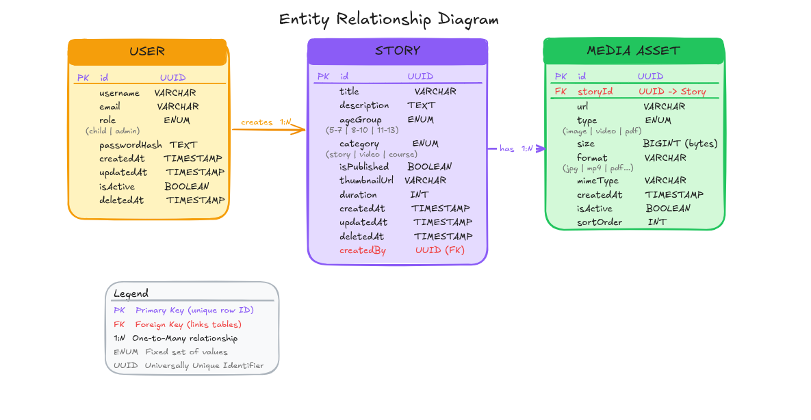
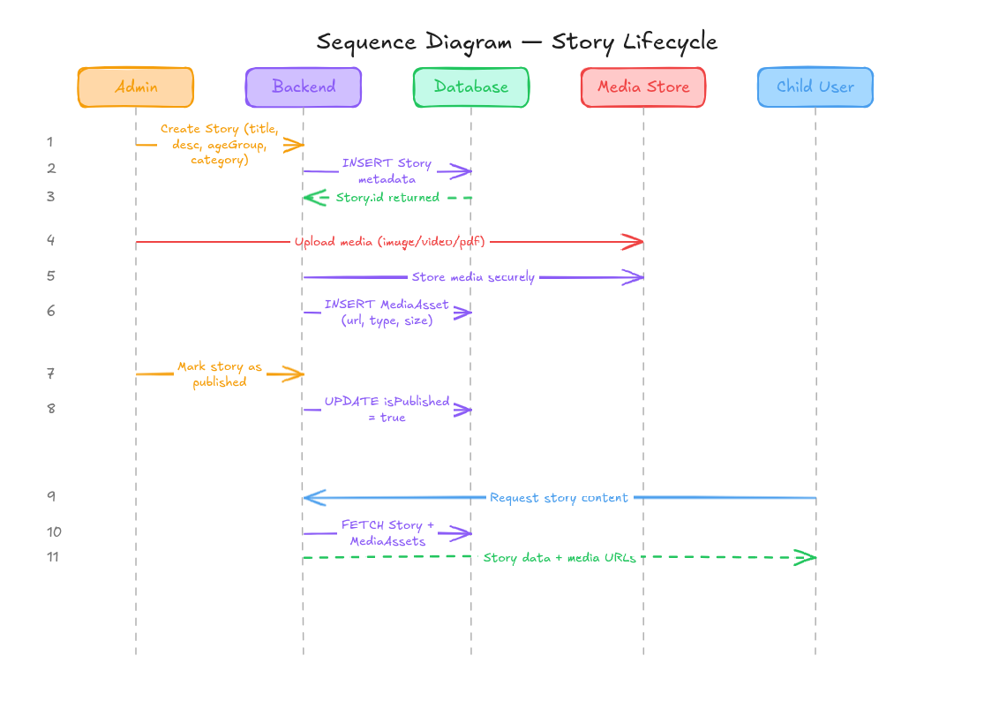

# Stories Feature Documentation

## Description

**Feature:** "Stories"

**Goal:** Deliver curated educational content safely to children on the المنزل الآمن platform.

**Scope:**
- Admins upload stories and associated media (images, videos, PDFs).
- Children request stories to read/view.
- Content must be secure, optimized, and age-appropriate.

**Key Considerations:**
- Content is pre-approved; users cannot create content.
- Media upload and delivery must be secure.
- Media optimization for fast delivery.

## Tasks

- Document story lifecycle.
- Specify upload security and media policy.
- Create diagrams:
  - Entity Diagram (Story, MediaAsset, User relations)
  - Sequence Diagram (Secure upload flow)
- ImageKit setup:
  - Signed URLs for private content
  - Upload policies (size/type limits)
- Infrastructure plan:
  - Express endpoint for ImageKit auth parameters

---

## 1. Entity Diagram

**User**
| Column     | Type                       |
|------------|----------------------------|
| id         | string (UUID)              |
| username   | string                     |
| role       | enum ('child', 'admin')    |
| email      | string                     |
| password   | string (hashed)            |
| createdAt  | Date                       |
| updatedAt  | Date                       |

**Story**
| Column       | Type                              |
|--------------|----------------------------------|
| id           | string (UUID)                     |
| title        | string                            |
| description  | string                            |
| ageGroup     | enum ('5-7', '8-10', etc.)       |
| category     | enum ('story', 'video', 'course')|
| isPublished  | boolean                           |
| authorId     | string (FK → User.id)             |
| createdAt    | Date                              |
| updatedAt    | Date                              |

**MediaAsset**
| Column     | Type                             |
|------------|---------------------------------|
| id         | string (UUID)                    |
| storyId    | string (FK → Story.id)           |
| url        | string                           |
| type       | enum ('image', 'video', 'pdf')   |
| size       | number (bytes)                   |
| format     | string ('jpg', 'mp4', 'pdf', etc.) |
| createdAt  | Date                             |

**Relationships**
- Story has many MediaAssets
- MediaAsset belongs to one Story
- User (child) reads Story

---

## 2. Story Lifecycle

1. Admin creates story offline or in admin panel
2. Admin uploads media securely
3. Backend stores Story metadata and MediaAsset references
4. Story marked as published
5. Child user requests content
6. Backend serves story + media URLs
7. Story may be updated or archived later

**Notes:**
- Child users never upload or edit content.
- All content safety checks happen before publishing.

---

## 3. Sequence Diagram — Secure Upload

**Flow:**
Client requests an upload token from Backend
Backend validates the user and generates a presigned URL
Presigned URL is returned to client (dashed = response)
Client uploads the file directly to Cloud Storage (bypasses backend for efficiency)
Cloud Storage confirms the upload
Client notifies Backend of completion
Backend saves the MediaAsset record to the Database
DB confirms → Backend returns "Upload finalized" to the client

**Admin Client → Backend → ImageKit → Storage/CDN**

**Steps:**
1. Admin requests upload authentication from backend
2. Backend generates signed parameters (token + signature + expiry)
3. Admin uploads media directly to ImageKit using signed params
4. ImageKit stores and optimizes media
5. Admin submits story metadata + media URLs to backend
6. Backend saves Story + MediaAsset references
7. Child requests story → Backend serves content via API

**Key Principles:**
- Media never passes through backend servers.
- Only signed uploads are allowed.

---

## 4. ImageKit Setup Plan

- Use ImageKit for media storage, optimization, and delivery.
- Backend generates signed upload parameters for admins.
- Enable signed URLs for private content delivery (prevent unauthorized access).
- Built-in media optimization (resize, compression, WebP conversion).

---

## 5. Upload Policy (Security & Validation)

**File Types**
- Images → jpeg, png, webp
- Videos → mp4
- Documents → pdf

**File Size Limits**

| Type    | Max Size |
|---------|----------|
| Image   | 5 MB     |
| Video   | 20 MB    |
| PDF     | 10 MB    |

**Validation**
- Client-side: file type & size check
- Backend: verify metadata & file type
- Only signed uploads are accepted

**Media Organization**
/stories/{storyId}/images/
/stories/{storyId}/videos/
/stories/{storyId}/documents/

---

## 6. Infrastructure Plan

**Backend Responsibilities**
- Authenticate admin users
- Generate signed upload parameters
- Store story metadata and media references
- Serve content to child users via API

**Express Endpoint Concept**
GET /api/upload-auth

Returns signed parameters for admin uploads.

**Storage**
- Database: story + media metadata
- ImageKit: media storage + CDN

---

## 7. Production Architecture
Admin Panel (Content Upload) ↓

Backend (Express API + Auth) ↓

ImageKit (Upload + CDN + Optimization) ↓

Database (Stories + Media Metadata) ↓

Child Frontend (Content Consumption)
