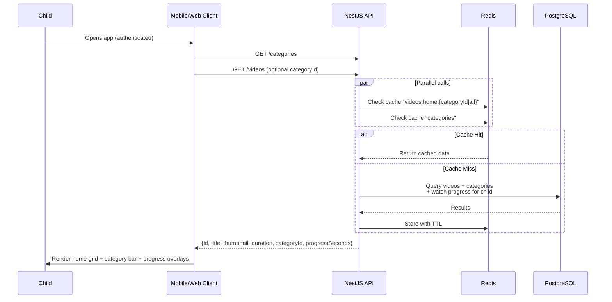
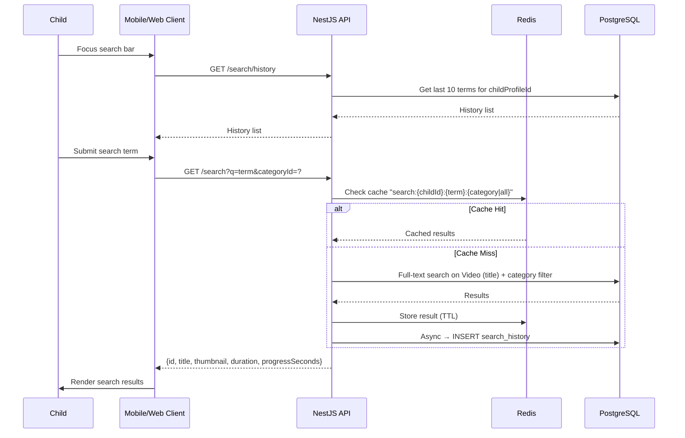
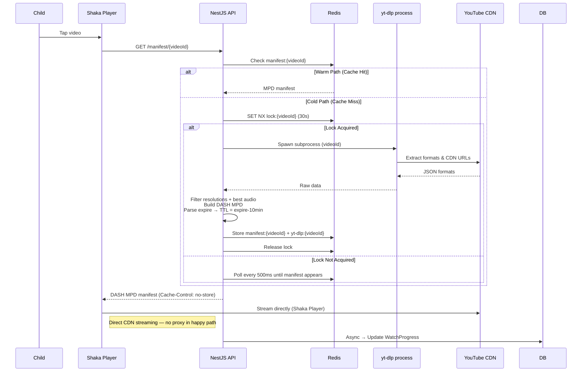
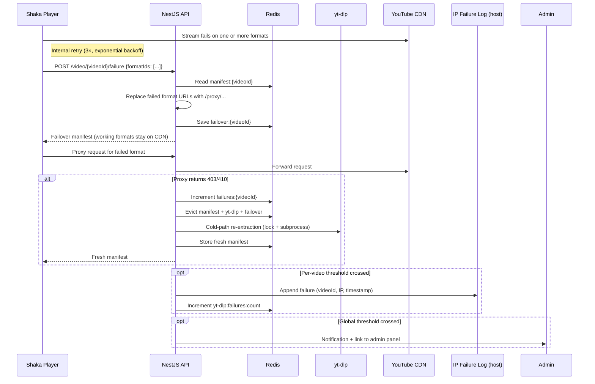
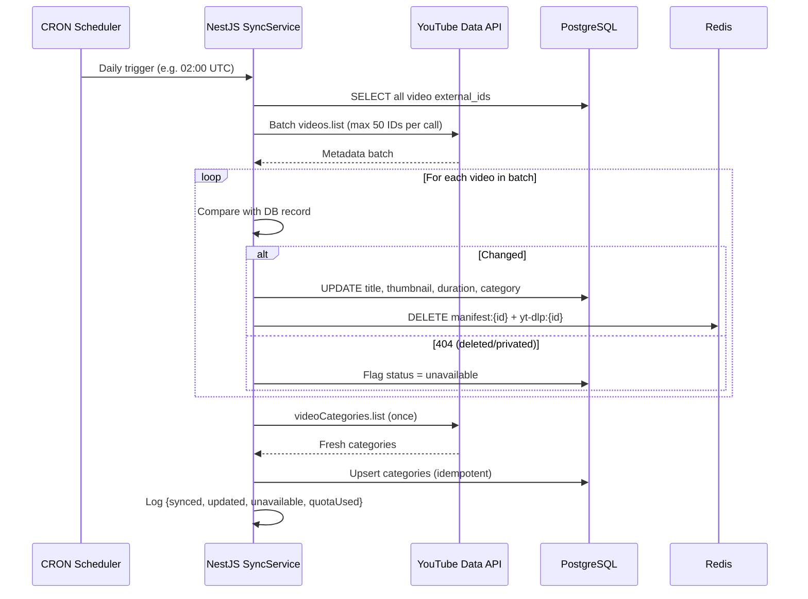
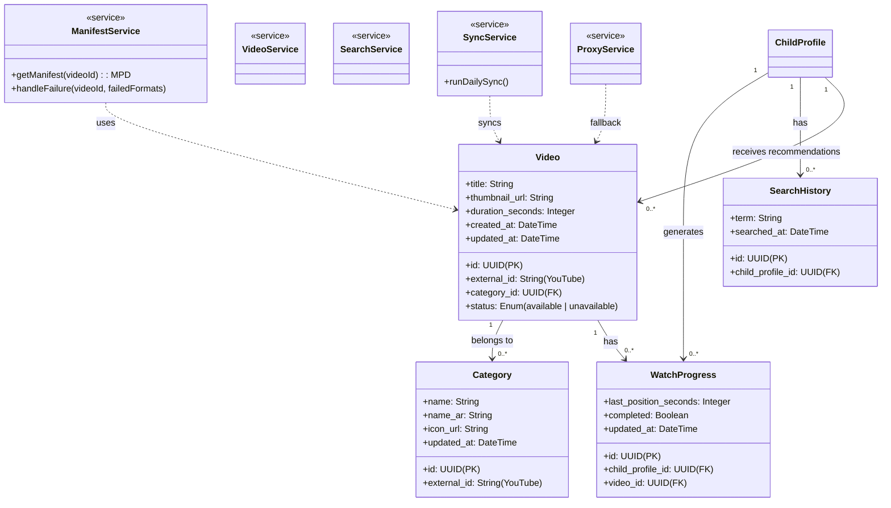

# Visual Content Module — Technical Specification

---

## Table of Contents

1. [Overview](#1-overview)
2. [Tools & API Reference](#2-tools--api-reference) _(collapsible)_
3. [Architecture](#3-architecture)
4. [Sequence Diagrams](#4-sequence-diagrams)
5. [Class & Entity Diagram](#5-class--entity-diagram)
6. [External API & Integration Specifications](#6-external-api--integration-specifications)
7. [Legal & Compliance Framework](#7-legal--compliance-framework)
8. [Requirements Specifications](#8-requirements-specifications)
9. [Deployment Guide](#9-deployment-guide)
10. [Operational Runbook](#10-operational-runbook)

---

## 1. Overview

This module implements a curated, ad-free video experience for a children's platform. It does not expose the raw YouTube experience — instead it presents a pre-filtered, recommendation-controlled subset of YouTube content with full parental oversight.

The system operates across two clearly separated layers:

**Content Management Layer** — Admins and parents populate a curated video library. Videos originate from YouTube but are catalogued in the platform's own database with metadata fetched via the YouTube Data API. A CRON job keeps metadata in sync. This layer is partially out of scope for this module but directly informs playback decisions.

**Playback Layer** — The core of this module. Video streaming entirely bypasses the standard YouTube embed. Instead of using the IFrame Player API, `yt-dlp` extracts direct CDN stream URLs, the backend generates a DASH manifest, and the frontend player (e.g., Shaka on web, `better_player` on Flutter) streams directly from the YouTube CDN. This is what enables ad-free playback — no YouTube player is loaded, so ads are never injected.

The architecture around `yt-dlp` is designed for resilience: Redis caches manifests with TTL derived from CDN URL expiry, a distributed lock prevents redundant cold-path extractions, a failure-tracking system drives operational alerts, per-format fallback proxying handles partial CDN failures, and IPv6 rotation mitigates IP bans.

---

## 2. Tools & API Reference

<details>
<summary><strong>Click to expand — Tools & API Reference</strong></summary>

### 2.1 YouTube Data API v3 (Official)

**Purpose:** Fetching video metadata (titles, thumbnails, descriptions, duration, category) and refreshing the category list. Not used for search or stream URL retrieval.

**Authentication:** API Key, scoped to YouTube Data API v3 in Google Cloud Console. Always stored server-side in `.env`. Never exposed to the client.

**Quota:** 10,000 units/day by default. Key costs:

- `videos.list` — **1 unit** per call, supports up to 50 IDs per batch
- `videoCategories.list` — **1 unit** per call
- `search.list` — **100 units** per call (not used in production; documented for reference)

**Quota ceiling:** The daily limit of 10,000 units is a hard ceiling. Requesting an increase requires a Google compliance audit — a multi-week process involving review of the application's adherence to YouTube's API Terms of Service. Given the nature of this platform, this path is not viable. The implementation must be designed to never approach the quota.

**References:**

- [YouTube Data API v3 — Getting Started](https://developers.google.com/youtube/v3/getting-started)
- [Quota Cost Calculator](https://developers.google.com/youtube/v3/determine_quota_cost)
- [google-api-nodejs-client (official Node.js client)](https://github.com/googleapis/google-api-nodejs-client)
- [NestJS HttpModule documentation](https://docs.nestjs.com/techniques/http-module)

---

### 2.2 yt-dlp

**Purpose:** Extracts direct CDN stream URLs from YouTube videos. The primary mechanism for ad-free playback. A Python CLI tool, invoked as a subprocess from the NestJS backend.

**Limitations:**

- Reverse-engineered tool; depends on YouTube's internal API not changing. Breaking changes occur periodically with no notice and no automated fix.
- Requires a sidecar `bgutil-ytdlp-pot-provider` service for PO Token handling on datacenter IPs (see §3.4).
- Not a persistent HTTP service — each invocation spawns a child process.

**References:**

- [yt-dlp — GitHub repository](https://github.com/yt-dlp/yt-dlp)
- [yt-dlp — JSON output format documentation](https://github.com/yt-dlp/yt-dlp#output-template)
- [bgutil-ytdlp-pot-provider](https://github.com/brainbots/bgutil-ytdlp-pot-provider)

---

### 2.3 Redis

**Purpose:** Caching DASH manifests and raw yt-dlp output (warm-path delivery), distributed locking (preventing concurrent cold-path extraction), failure counters (per-video and global), and failover manifest storage.

**Required configuration:** AOF persistence with `appendfsync everysec`. Redis is a hard dependency — without it, locking fails and cold-path requests fan out, spawning multiple yt-dlp processes per video.

**References:**

- [Redis Persistence documentation](https://redis.io/docs/management/persistence/)
- [NestJS Cache Manager](https://docs.nestjs.com/techniques/caching)

---

### 2.4 Shaka Player (Web)

**Purpose:** Open-source DASH/HLS player from Google. Loads the MPD manifest served by the backend and streams directly from YouTube CDN URLs embedded in it. Supports adaptive bitrate, multi-retry, and custom error handling.

**Note:** Shaka has no official React wrapper but integrates straightforwardly with a `useRef` on a `<video>` element. Alternative web players that support DASH include `video.js` with the `videojs-http-streaming` plugin. The choice of player is for the frontend team; the requirement is DASH (MPD) support with `Content-Type: application/dash+xml`.

**References:**

- [Shaka Player — GitHub](https://github.com/shaka-project/shaka-player)
- [Shaka Player — Documentation](https://shaka-project.github.io/shaka-player/docs/api/index.html)

---

### 2.5 better_player (Flutter / Mobile)

**Purpose:** Flutter plugin supporting DASH and HLS playback with adaptive bitrate, track selection, picture-in-picture, HTTP headers, and playlist support. The recommended option for the Flutter team for this use case.

**Critical iOS/macOS constraint:** AVPlayer (the iOS/macOS native player used by Flutter) does not natively support DASH (MPD). On Apple platforms, the backend must serve HLS (`.m3u8`) manifests instead. The backend and mobile teams must align on format negotiation — whether this is handled via `Accept` headers, a platform-specific endpoint, or a separate manifest type.

**References:**

- [better_player — pub.dev](https://pub.dev/packages/better_player)
- [DASH vs HLS — MDN overview](https://developer.mozilla.org/en-US/docs/Web/Media/DASH_Adaptive_Streaming_for_HTML_5_Video)

---

### 2.6 YouTube IFrame Player API (Alternative / Fallback reference)

> **Note:** The IFrame Player API is **not** the primary approach. The system uses `yt-dlp` + DASH/HLS manifests, which bypasses the YouTube player entirely. This section is retained for reference only, in case the team evaluates a fallback to the IFrame approach.

The IFrame API embeds a YouTube player via an `<iframe>` tag, controlled via JavaScript. It serves the YouTube-hosted player, which includes ads. Ad-free playback is not achievable through this approach.

**Recommendation suppression (IFrame approach):** The IFrame API provides no direct way to suppress YouTube's end-of-video recommendation overlay. The `rel=0` parameter limits suggestions to the same channel but does not remove the overlay. The correct workaround is to intercept the `ENDED` player state via `onStateChange` and render the platform's own recommendation UI before the overlay appears. This is irrelevant in the current `yt-dlp` approach.

**References:**

- [YouTube IFrame Player API](https://developers.google.com/youtube/iframe_api_reference)
- [Player Parameters reference](https://developers.google.com/youtube/player_parameters)

</details>

---

## 3. Architecture

### 3.1 High-Level Component Map

```
Child / Parent
     │
     ▼
Mobile/Web Client
  (Shaka / better_player)
     │
     │  GET /manifest/{videoId}
     │  GET /videos, /search, /categories
     ▼
NestJS API
  ├── ManifestService   ──── yt-dlp subprocess ──── YouTube CDN
  ├── VideoService      ──── PostgreSQL
  ├── SearchService     ──── PostgreSQL + Redis
  ├── SyncService       ──── YouTube Data API
  └── ProxyService      ──── YouTube CDN (fallback only)
     │
     ▼
Redis  ◄──────────────── lock, cache, failure counters
     │
PostgreSQL ◄──────────── video library, categories, watch progress, search history
```

After loading the manifest, **Shaka streams directly from YouTube CDN** — the NestJS backend is not in the streaming path during normal playback. The proxy is only used as a last resort when direct CDN URLs fail for specific formats.

---

### 3.2 Video Playback — Cold and Warm Paths

**Warm path (cache hit):** The DASH manifest for the requested video is already in Redis. The backend returns it immediately. Target latency: under 200ms.

**Cold path (cache miss):**

1. Backend acquires a Redis lock (`SET NX EX 30` on `lock:{videoId}`) to prevent concurrent extractions.
2. `yt-dlp` subprocess is spawned with the video ID.
3. yt-dlp returns available formats and CDN URLs as JSON.
4. Backend filters to target resolutions: `[144p, 240p, 360p, 480p, 720p, 1080p]` and selects the best audio stream.
5. Backend constructs a DASH MPD manifest with direct CDN URLs; parses the `expire` timestamp from the CDN URL to derive the Redis TTL (expire − 10 minutes).
6. `manifest:{videoId}` and `yt-dlp:{videoId}` are stored in Redis. Lock is released.
7. Manifest is returned to the client.

Target cold-path latency: under 5 seconds.

---

### 3.3 Fallback & Failure Handling

The failure flow operates across two distinct stages: CDN-level failures reported by the frontend player, and proxy-level failures detected by the backend. Only the second stage increments counters.

**Stage 1 — CDN format failure (frontend-reported):**

When Shaka encounters a stream error it retries internally (3 attempts, exponential backoff starting at 1 second). After exhausting retries for a format, the client reports the failure to `POST /video/{videoId}/failure` with the list of failed format IDs. No counter is incremented at this stage. The backend:

1. Takes the current `manifest:{videoId}` from Redis.
2. Replaces the CDN URLs for the failed formats with proxy URLs pointing to `/proxy/{videoId}/{formatId}`.
3. Saves the updated manifest as `failover:{videoId}` in Redis (original manifest is kept intact).
4. Returns the failover manifest to the client.

Working resolutions continue hitting the CDN directly — only failed formats are proxied.

**Stage 2 — Proxy failure (backend-detected):**

If a proxied format request to `/proxy/{videoId}/{formatId}` itself fails (403/410 from the YouTube CDN), the backend:

1. Increments `failures:{videoId}` in Redis.
2. Evicts all keys for that video: `manifest:{videoId}`, `yt-dlp:{videoId}`, `failover:{videoId}`. The `failures:{videoId}` key is **not** deleted.
3. Invokes yt-dlp again (cold start) to re-extract fresh CDN URLs.
4. Stores the new `manifest:{videoId}` and `yt-dlp:{videoId}` in Redis.
5. Returns the fresh manifest to the client.

**Per-video failure threshold:**

If `failures:{videoId}` exceeds the configured per-video threshold, the video ID is logged to the IP failure log (a shared location accessible to both the NestJS application and the IPv6 rotation script — see §3.6). The global `yt-dlp:failures:count` is then incremented.

**Global failure threshold:**

If `yt-dlp:failures:count` exceeds its threshold, the system notifies the admin with an IP rotation recommendation. If the admin continues to receive repeated notifications, this signals that IP rotation alone is insufficient and deeper investigation (yt-dlp update, poToken sidecar check) is warranted. The admin takes corrective action via the admin panel (see §3.6) — no direct Redis or database commands are needed.

**If yt-dlp is fully down and cache is expired:**

The platform displays a service degradation message: the video section is temporarily unavailable, but other features (stories, games) remain accessible. No video content is shown until yt-dlp recovers.

---

### 3.4 PO Token (Bot Detection) Sidecar

YouTube uses PO Tokens (Proof-of-Origin Tokens) as a cryptographic attestation mechanism to distinguish automated traffic from legitimate requests. Datacenter IPs are particularly susceptible to triggering "Sign in to confirm you're not a robot" blocks, which cause yt-dlp to fail regardless of IP rotation.

The `bgutil-ytdlp-pot-provider` plugin integrates with yt-dlp via the PO Token Provider Framework and retrieves tokens from a dedicated HTTP server (available as a prebuilt Docker image). It is recommended to run it as a separate sidecar container. If a separate container is not feasible, the HTTP server can also run as an in-process service inside the same container as yt-dlp, reachable on a localhost port — the Docker image is self-contained and supports both deployment modes. Token cache TTL defaults to 6 hours and is configurable via `TOKEN_TTL`.

**This is distinct from IP banning.** IP bans affect extractions from a given IP address. PO Token failures affect all extractions regardless of IP if YouTube's bot detection tightens enforcement. Both failure modes can occur simultaneously or independently and should be tracked as separate operational signals.

---

### 3.5 Cookies & Age-Restricted Content

Cookies are not required for normal public videos and are not part of the routine operational setup. They become necessary for age-restricted content and for videos behind YouTube's "sign in to confirm" gate — increasingly triggered by server IPs flagged for automated traffic.

Since the platform controls which videos are admitted to the library, age-restricted content can be excluded at the content management level. However, a video that was previously accessible may later be age-restricted by YouTube without notice. The CRON sync job should detect this and flag the video as unavailable. It is worth building URL validation into the video ingestion flow (when admins or parents add a YouTube URL) to verify accessibility with yt-dlp before the video is admitted to the library.

---

### 3.6 IPv6 Rotation

IPv6 rotation runs as a host-level script, independent of the application on its normal schedule. However, both the NestJS application and the rotation script share access to a common IP failure log — a persistent file or lightweight store on the host — allowing the rotation script to make informed decisions about whether to rotate based on failure signals from the application, rather than rotating blindly on a timer.

The NestJS application contributes to this shared log by:

- Recording the current outbound IP at extraction time (via `ip route get` or equivalent at process start).
- Appending a failure entry (video ID, timestamp, current IP, error type) whenever the per-video failure threshold is crossed and `yt-dlp:failures:count` is incremented.

The rotation script reads this log before deciding whether an early rotation is warranted. On a scheduled run, if recent failure entries reference the current IP, rotation proceeds. If failure entries have already ceased (indicating recovery), rotation can be skipped.

**No direct Redis or database access is required from the admin** to manage this. All state resets and rotation triggers are exposed through the admin panel:

- **Reset failure counters** — clears `yt-dlp:failures:count` and the per-video `failures:{videoId}` entries for affected videos, and clears the IP failure log entries for the current IP.
- **Trigger manual IP rotation** — sends a signal to the rotation script to execute immediately and resets counters.
- **View current state** — shows the current outbound IP, recent failure log entries, and system status (`operational` / `degraded` / `down`).

**Sidecar fallback:** If running a dedicated poToken sidecar container alongside yt-dlp is not feasible (e.g., resource-constrained environments), the `bgutil-ytdlp-pot-provider` HTTP server mode can be run inside the same container as yt-dlp. The Docker image for the provider is self-contained and does not strictly require a separate container — it can be bundled as a process within the yt-dlp container, with the NestJS application configured to reach it on a localhost port.

---

## 4. Sequence Diagrams

### List of Diagrams

| #   | Name                                | File                                               |
| --- | ----------------------------------- | -------------------------------------------------- |
| 1   | User Entry & Home Screen Load       | `diagrams/visual_content/01_home_load.svg`         |
| 2   | Search Flow                         | `diagrams/visual_content/02_search.svg`            |
| 3   | Video Playback — Cold Path          | `diagrams/visual_content/03_playback_cold.svg`     |
| 4   | Video Playback — Failure & Fallback | `diagrams/visual_content/04_playback_fallback.svg` |
| 5   | CRON Metadata Sync                  | `diagrams/visual_content/05_cron_sync.svg`         |

---

<details>
<summary><strong>Diagram 1 — User Entry & Home Screen Load (sequence description)</strong></summary>

**Actors / Participants:** `Child`, `Mobile/Web Client`, `NestJS API`, `PostgreSQL DB`, `Redis`

**Sequence:**

1. `Child` opens the application (authenticated session assumed — auth is out of scope for this module).
2. `Client` sends `GET /categories` — follows the same Redis-first pattern as video list (separate request, can be parallel).
3. `Client` sends `GET /videos` with optional `categoryId` filter (default: none).
4. `NestJS` checks `Redis` for cached response under key `videos:home:{categoryId|all}`.
5. **[alt: Cache hit]** Return cached video list → go to step 8.
6. **[alt: Cache miss]** `NestJS` queries `PostgreSQL` for videos, joining on `Category` and `WatchProgress` for the current child profile. Excludes videos where all available content has already been watched.
7. `NestJS` writes result to `Redis` with appropriate TTL.
8. Response assembled: `{ id, title, thumbnail, duration, categoryId, progressSeconds }`.
9. `Client` renders the home screen grid with category filter bar and watch progress overlays.



</details>

---

<details>
<summary><strong>Diagram 2 — Search Flow (sequence description)</strong></summary>

**Actors / Participants:** `Child`, `Client`, `NestJS API`, `PostgreSQL DB`, `Redis`

**Sequence:**

1. `Child` focuses the search bar — `Client` fetches `GET /search/history` and renders previous search terms for the current child profile (read from DB, no cache needed).
2. `Child` submits a search term.
3. `Client` sends `GET /search?q={term}&categoryId={optional}`.
4. `NestJS` checks `Redis` for key `search:{childProfileId}:{normalizedTerm}:{categoryId|all}`.
5. **[alt: Cache hit]** Return cached results → go to step 8.
6. **[alt: Cache miss]** `NestJS` queries `PostgreSQL` — full-text or LIKE search on `title` within the curated video library; applies `categoryId` filter if present.
7. `NestJS` writes result to `Redis` with TTL. Writes the search term to `search_history` in `PostgreSQL` as a fire-and-forget async side effect (not blocking the response).
8. `Client` renders search results: `{ id, title, thumbnail, duration, progressSeconds }`.



</details>

---

<details>
<summary><strong>Diagram 3 — Video Playback: Cold Path (sequence description)</strong></summary>

**Actors / Participants:** `Child`, `Client (Shaka Player)`, `NestJS API`, `Redis`, `yt-dlp process`, `YouTube CDN` (external)

**Sequence:**

1. `Child` taps a video.
2. `Client` sends `GET /manifest/{videoId}`.
3. `NestJS` checks `Redis` for `manifest:{videoId}`.
4. **[alt: Warm path — cache hit]** Return MPD manifest directly → jump to step 13.
5. **[alt: Cold path — cache miss]**
6. `NestJS` attempts `SET NX EX 30` on `lock:{videoId}` in `Redis`.
7. **[alt: Lock acquired]** Spawn `yt-dlp` subprocess for `videoId`.
8. **[alt: Lock not acquired — concurrent request]** Poll `Redis` every 500ms up to 25s waiting for `manifest:{videoId}` to appear, then return it once available.
9. `yt-dlp` returns JSON with available formats and CDN URLs.
10. `NestJS` filters to target resolutions `[144p, 240p, 360p, 480p, 720p, 1080p]`; selects best audio stream.
11. `NestJS` generates DASH MPD manifest with direct CDN URLs; parses CDN URL `expire` timestamp → sets Redis TTL = `expire − 10 minutes`.
12. `NestJS` stores `yt-dlp:{videoId}` (raw formats) and `manifest:{videoId}` (MPD) in `Redis`; releases lock.
13. `NestJS` returns MPD manifest with `Cache-Control: no-store`.
14. `Client (Shaka)` loads manifest and begins streaming **directly** from `YouTube CDN`. No proxying occurs in the happy path.
15. `NestJS` saves `WatchProgress` record to `PostgreSQL` (initial entry or timestamp update) — shown as async, not blocking playback.



</details>

---

<details>
<summary><strong>Diagram 4 — Video Playback: Failure & Fallback (sequence description)</strong></summary>

**Actors / Participants:** `Client (Shaka Player)`, `NestJS API`, `Redis`, `yt-dlp process`, `YouTube CDN` (external), `IP Failure Log` (shared file/store on host)

**Sequence — Stage 1: CDN failure (frontend-reported):**

1. `Shaka` encounters a stream error on one or more formats.
2. `Shaka` retries internally — 3 attempts, exponential backoff starting at 1s. Internal to client; no server involved.
3. After exhausting retries, `Client` sends `POST /video/{videoId}/failure` with `{ formatIds: [failedIds] }`. **No counter is incremented.**
4. `NestJS` reads `manifest:{videoId}` from `Redis`.
5. `NestJS` replaces CDN URLs for the failed format IDs with proxy URLs (`/proxy/{videoId}/{formatId}`).
6. `NestJS` saves the updated manifest as `failover:{videoId}` in `Redis`. Original `manifest:{videoId}` is kept.
7. `NestJS` returns the failover manifest to `Client`.
8. `Client (Shaka)` loads the failover manifest. Working resolutions continue streaming from `YouTube CDN` directly; failed formats go to `NestJS ProxyService`.

**Sequence — Stage 2: Proxy failure (backend-detected):** 9. `NestJS ProxyService` receives a proxied stream request for a failed format and forwards it to `YouTube CDN`. 10. `YouTube CDN` returns 403/410. 11. `NestJS` increments `failures:{videoId}` in `Redis`. 12. `NestJS` evicts `manifest:{videoId}`, `yt-dlp:{videoId}`, `failover:{videoId}` from `Redis`. `failures:{videoId}` is **not** deleted. 13. `NestJS` runs cold-path yt-dlp extraction (acquires lock, spawns subprocess, generates new manifest). 14. `NestJS` stores fresh `manifest:{videoId}` and `yt-dlp:{videoId}` in `Redis`. 15. `NestJS` returns the fresh manifest to `Client`.

**[opt: Per-video threshold crossed]** 16. If `failures:{videoId}` exceeds the per-video threshold: `NestJS` appends an entry to the `IP Failure Log` (video ID, timestamp, current outbound IP, error type). Increments `yt-dlp:failures:count` in `Redis`.

**[opt: Global threshold crossed]** 17. If `yt-dlp:failures:count` exceeds the global threshold: `NestJS` sends an admin notification with IP rotation recommendation and a link to the admin panel. Admin takes corrective action (rotation trigger, counter reset) via the admin panel — no direct Redis access needed.



</details>

---

<details>
<summary><strong>Diagram 5 — CRON Metadata Sync (sequence description)</strong></summary>

**Actors / Participants:** `CRON Scheduler`, `NestJS API (SyncService)`, `YouTube Data API` (external), `PostgreSQL DB`, `Redis`

**Sequence:**

1. `CRON Scheduler` triggers `SyncService.run()` on schedule (daily recommended).
2. `SyncService` queries `PostgreSQL` for all video IDs in the platform library.
3. `SyncService` batches IDs into groups of 50; calls `videos.list?part=snippet,contentDetails&id={batch}&key={API_KEY}` on the `YouTube Data API` (1 unit per batch of up to 50 videos).
4. For each video in the response:
   - Compare returned metadata with the DB record.
   - If changed: update `title`, `thumbnail_url`, `duration_seconds`, `category_id` in `PostgreSQL`.
   - If the video returns 404 (deleted or privated on YouTube): flag the video as `unavailable` in the DB. Do not delete the record.
5. `SyncService` calls `videoCategories.list` once per sync run to refresh the category list in `PostgreSQL` (idempotent upsert).
6. For any video whose metadata changed: delete `manifest:{videoId}` and `yt-dlp:{videoId}` from `Redis` to force re-extraction on next play (stale manifests may reference outdated content).
7. Log sync result: `{ synced, updated, unavailable, quotaUsed }`.



</details>

---

## 5. Class & Entity Diagram

| Diagram                                 | File                                          |
| --------------------------------------- | --------------------------------------------- |
| Entity / Class Diagram (Visual Content) | `diagrams/visual_content/06_class_entity.svg` |

<details>
<summary><strong>Key entities and fields for this module</strong></summary>

**Video**

- `id`, `external_id` (YouTube video ID), `title`, `thumbnail_url`, `duration_seconds`, `category_id`, `status` (`available` | `unavailable`), `created_at`, `updated_at`

**Category**

- `id`, `external_id` (YouTube category ID), `name`, `updated_at`

**WatchProgress**

- `id`, `child_profile_id`, `video_id`, `last_position_seconds`, `completed` (boolean), `updated_at`

**SearchHistory**

- `id`, `child_profile_id`, `term`, `searched_at`

**SystemStatus** (or managed via Redis `yt-dlp:failures:count`)

- `failures_count`, `last_failure_at`, `state` (`operational` | `degraded` | `down`)
</details>

<details>
<summary><strong>Diagram</strong></summary>



</details>

---

## 6. External API & Integration Specifications

### 6.1 YouTube Data API v3 (Official)

**Purpose:** Metadata retrieval and category sync. Not used for stream URL extraction or search.

**Authentication:** Server-side API Key in `.env`. All calls are made from NestJS — the key is never exposed to the client.

```
Frontend → NestJS API → YouTube Data API
```

**Endpoints used in production:**

`GET /videos?part=snippet,contentDetails&id={id1,id2,...}&key={API_KEY}`

- Fetches metadata for up to 50 video IDs in a single call.
- Cost: 1 unit per call regardless of the number of IDs (batching is essential).
- Returns: `snippet` (title, description, thumbnails, channelId, publishedAt) and `contentDetails` (duration, dimension).

`GET /videoCategories?part=snippet&regionCode=US&key={API_KEY}`

- Fetches the list of YouTube video categories.
- Cost: 1 unit per call.
- Called once per CRON sync run.

**Quota management:**

- All `videos.list` calls must be batched in groups of up to 50 IDs. A CRON job syncing 500 videos uses only 10 quota units total.
- The quota ceiling is 10,000 units/day. Requesting an increase requires a Google compliance audit that is not viable for this platform. The system must never rely on exceeding this limit.
- A circuit breaker should be implemented: if `quotaUsed` approaches the daily limit (configurable threshold, e.g., 9,000 units), the CRON job should halt and notify admins rather than fail silently.

**Endpoints documented for reference (not used in current implementation):**

<details>
<summary>search.list (reference only)</summary>

`GET /search?part=snippet&q={query}&type=video&key={API_KEY}`

- Cost: **100 units per call** — the most expensive operation. Not used; search is performed against the platform's own DB.
- Documented in case the team evaluates a hybrid search approach in the future.

`GET /playlistItems?part=snippet&playlistId={id}&key={API_KEY}`

- Retrieves videos within a playlist for bulk ingestion by admins.
- Each item contains `snippet.resourceId.videoId`.
- Pagination handled via `pageToken`.

</details>

---

### 6.2 Stream Extraction Layer (yt-dlp)

**Purpose:** Extracting direct `.m4a` (audio) and `.mp4`/`.webm` (video) CDN URLs from YouTube and generating DASH/HLS manifests.

**Data flow (happy path):**

1. Client requests `GET /manifest/{videoId}`.
2. NestJS acquires a Redis lock and spawns a `yt-dlp` subprocess.
3. yt-dlp (assisted by the poToken sidecar) queries YouTube via an IPv6 address from the rotation pool.
4. yt-dlp returns a JSON format list with CDN URLs per resolution.
5. NestJS constructs a DASH MPD manifest (or HLS `.m3u8` for Apple platforms) with direct CDN URLs.
6. Manifest is cached in Redis with TTL derived from CDN `expire` parameter minus a 10-minute safety buffer.
7. Manifest is returned to the client. Shaka / better_player streams directly from the CDN.

**Expected stream formats:**

- Video: `mp4` (H.264) and optionally `webm` (VP9/AV1) at multiple resolutions.
- Audio: `m4a` (AAC), sometimes `webm` (Opus).
- The backend should prefer H.264 video streams for maximum compatibility.
- iOS requires HLS; all other platforms use DASH. Format negotiation should be explicit (e.g., via a query parameter or `Accept` header).

**Proxy fallback:**

- Only activated for formats that have failed CDN delivery.
- NestJS fetches the raw stream bytes from YouTube CDN and proxies them to the client.
- This is a last resort — it significantly increases backend bandwidth and should never be the primary path.

---

## 7. Legal & Compliance Framework

> ⚠️ This section reflects informed context, not legal advice. For a commercial product with paying users, consult a qualified lawyer.

### 7.1 Terms of Service Considerations

Accessing YouTube through non-standard interfaces, blocking ads, or circumventing YouTube's systems technically violates YouTube's Terms of Service. This platform is framed as a **private proxy and parental-control tool** rather than a commercial product, which partially mitigates — but does not eliminate — direct litigation risk.

**Enforcement mechanisms YouTube can apply without a court:**

- **IP bans** at the infrastructure level, causing service outages with no notice.
- **Cease-and-desist letters**, which impose legal costs and downtime risk even if ultimately unenforceable.
- **Account/service termination** if infrastructure is linked to Google accounts.

**Known legal precedent:** Courts in the US (_hiQ v. LinkedIn_, _Van Buren_) have generally found that scraping publicly accessible data does not violate the CFAA. However, YouTube can still pursue breach-of-contract or copyright claims, or apply technical enforcement (IP bans) without any legal process. ToS violation is not the same as breaking the law, but the practical risks are real.

**Use of the official YouTube Data API:** API calls must comply with Google's Developer Policy. Selling or redistributing API data, or using API data to train AI models, is prohibited.

### 7.2 Privacy & Child Safety (COPPA / GDPR-K)

Since the target audience is children, the platform must apply heightened data protection standards:

- **Zero tracking policy:** No PII (Personally Identifiable Information) is collected from child profiles. No behavioral data is sent to Google or third-party trackers.
- **Data minimization:** Parental accounts manage "Allowed Lists," but child interaction data (watch progress, search history) is stored locally on the platform's own server and not shared externally.
- **COPPA compliance:** Recommendation weights and usage statistics remain local to the server. No advertising identifiers or cross-site tracking.
- **GDPR-K alignment:** If the platform targets users in the EU, the same principles apply. Parental consent mechanisms should be documented separately.

### 7.3 Intellectual Property

The system does not host or redistribute content. It acts as a **dynamic manifest generator** — CDN URLs embedded in the manifest still point to YouTube's own servers. YouTube CDN traffic flows directly from the client to YouTube's infrastructure; the platform does not cache or re-serve video bytes (except transiently in the fallback proxy path).

**Fair use framing:** The project provides an "accessibility and safety wrapper" offering a transformative interface for existing public content. The removal of ads is the primary legal exposure point.

**Content copyright:** The content being streamed (video, audio) is owned by creators and licensed to YouTube. The platform's legal exposure is in the access mechanism, not content hosting. Proxying increases exposure meaningfully — it should remain a last-resort fallback, not a routine path.

**GPL v3 (yt-dlp):** yt-dlp is licensed under the Unlicense (public domain). Any GPL-licensed components in the stack (e.g., if Piped is later added) would not require open-sourcing the NestJS backend under SaaS usage, since GPL copyleft is triggered by distribution, not server-side use.

---

## 8. Requirements Specifications

### Functional Requirements (FR)

**FR1: Content Discovery & Curation**

- **FR1.1 — Library Search:** The system shall allow users to search for videos only within the curated database. Search results must include title, duration, and a watched-progress indicator.
- **FR1.2 — Category Filtering:** The home screen shall display a horizontal category bar synced with YouTube's `videoCategories`. Selecting a category must filter the visible videos accordingly.
- **FR1.3 — Search History:** The system shall store and display the last 10 search terms per child profile to facilitate quick re-discovery.
- **FR1.4 — Recommendation Control:** The system shall display recommendations only from the platform's curated library. It must explicitly prevent the display of YouTube's native end-of-video recommendation overlays.
- **FR1.5 — Unwatched Prioritization:** The system shall avoid surfacing only previously watched videos. Home screen queries must account for watch history and ensure unwatched content is given priority.

**FR2: Video Playback Experience**

- **FR2.1 — Ad-Free Streaming:** The system shall provide an ad-free playback experience by extracting direct stream URLs and serving them via a custom DASH/HLS manifest.
- **FR2.2 — Playback Controls:** The player shall support standard controls: Play, Pause, Seek (scrubbing), Volume, and Full-screen toggle.
- **FR2.3 — Playlist Navigation:** The player shall provide Next and Previous buttons to navigate through the current filtered list or playlist.
- **FR2.4 — Resume Playback:** The system shall save the child's playback position (`last_position_seconds`) every 30 seconds and upon pausing or closing, allowing the child to resume exactly where they left off.
- **FR2.5 — Degraded State UX:** When yt-dlp is marked as down and all cached manifests have expired, the player section shall display a clear service-unavailable message and redirect users to available features (stories, games).

**FR3: Management & Sync**

- **FR3.1 — Parental Ingestion:** Parents shall be able to add videos by pasting a YouTube URL. The system must automatically extract the video ID, validate accessibility via yt-dlp, and fetch metadata (title, duration, thumbnail) via the YouTube Data API.
- **FR3.2 — Automated Metadata Sync:** The system shall run a daily CRON job to update local metadata and flag any videos that have been deleted or made private on YouTube.
- **FR3.3 — Quota Tracking:** YouTube Data API quota usage shall be tracked. CRON jobs shall support graceful failure: if quota is exhausted, the operation shall halt with an admin notification rather than fail silently.

---

### Non-Functional Requirements (NFR)

**NFR1: Performance & Latency**

- **NFR1.1 — Extraction Latency:** Cold-path video extraction (via yt-dlp) should not exceed 5 seconds. Warm-path (cached) manifest delivery must occur in under 200ms.
- **NFR1.2 — Streaming Continuity:** The frontend player must implement a multi-retry strategy (3 attempts, exponential backoff) before escalating to the backend failure endpoint.

**NFR2: Reliability & Availability**

- **NFR2.1 — Failover Resilience:** If a direct CDN URL fails, the system must transparently update the manifest to proxy the specific failed format through the NestJS backend, without affecting working resolutions.
- **NFR2.2 — Health Monitoring:** The system must track yt-dlp failures at two levels. Per-video: `failures:{videoId}` is incremented when proxy re-extraction fails for a video; once it exceeds the configured per-video threshold, the video ID and current IP are appended to the shared IP failure log and `yt-dlp:failures:count` is incremented. Global thresholds:
  - `failures:count < 3` → `operational`
  - `failures:count 3–5` → `degraded` (notify admins, continue serving)
  - `failures:count > 5` → `down` (halt new extractions, serve cached only, urgent alert)
    All counter resets and rotation triggers are exposed via the admin panel — no direct Redis or database access is required from the admin.
- **NFR2.3 — Redis Persistence:** Redis must be configured with AOF persistence (`appendfsync everysec`) to ensure active manifests, locks, and failure counters survive service restarts.
- **NFR2.4 — Decoupled yt-dlp Integration:** The yt-dlp integration must be decoupled (ManifestService + ProxyService) so updates to yt-dlp or the poToken sidecar do not require changes to the rest of the application. Given that YouTube makes breaking changes with no notice, the update path must be as frictionless as possible (single container redeploy).

**NFR3: Scalability & Constraints**

- **NFR3.1 — Quota Management:** All YouTube Data API calls must be batched (up to 50 IDs per call) to ensure the 10,000-unit daily limit is never exceeded.
- **NFR3.2 — Platform Compatibility:** The backend must generate both DASH (`.mpd`) and HLS (`.m3u8`) manifests. DASH is the primary format for Android and web; HLS is required for iOS and macOS (AVPlayer does not support DASH natively).
- **NFR3.3 — Lock Protection:** The yt-dlp extraction path must be protected by Redis locking (`lock:{videoId}`) to prevent duplicate cold-path executions under concurrent load.

**NFR4: Security & Compliance**

- **NFR4.1 — API Key Protection:** The YouTube API Key must be stored as a server-side environment variable and never exposed to client-side code.
- **NFR4.2 — IP Rotation:** To mitigate IP bans, the system must utilize an IPv6 rotator at the infrastructure level, ensuring extraction requests are spread across a `/64` CIDR block.
- **NFR4.3 — Child Data Protection:** The system must not collect or transmit PII from child profiles. All usage data (watch progress, search history) must remain local to the platform's infrastructure.

---

### Related System Components to Consider Later

**Parental Dashboard** — A management interface for parents to maintain Allowed Lists, view per-child usage statistics (time spent per category, watched video history), and receive alerts when content becomes unavailable.

**AI Recommendation Engine** — A future module to replace the current static recommendation logic with a per-profile affinity model. The current architecture (local library, category filtering) is designed to be compatible with this future module without significant refactoring.

**Video Validation on Ingestion** — A validation step in the admin/parent ingestion flow that invokes yt-dlp to verify that a submitted YouTube URL is accessible, not age-restricted, and extractable before admitting the video to the library.

---

## 9. Deployment Guide

### 9.1 Infrastructure Components

| Component            | Technology                | Notes                           |
| -------------------- | ------------------------- | ------------------------------- |
| API server           | NestJS (Node.js)          | Containerized                   |
| Database             | PostgreSQL                | AOF persistence                 |
| Cache / locks        | Redis                     | AOF with `appendfsync everysec` |
| Stream extractor     | yt-dlp                    | Subprocess or sidecar container |
| Bot detection bypass | bgutil-ytdlp-pot-provider | HTTP server mode, Docker image  |
| IP rotation          | Host-level IPv6 CRON      | `/64` CIDR block                |

---

### 9.2 Redis Configuration

Redis is a hard dependency. Recommended configuration for this use case:

```
appendonly yes
appendfsync everysec
```

AOF with `everysec` provides a good balance between durability and performance — at most one second of data is lost on a crash. This is acceptable for manifest cache and lock state; locks that survive a crash without the corresponding yt-dlp process simply expire after 30 seconds.

---

### 9.3 yt-dlp & poToken Sidecar

The `bgutil-ytdlp-pot-provider` should be deployed in HTTP server mode using the official Docker image. Configure yt-dlp to use the provider via the PO Token Provider Framework. The sidecar must be reachable from the NestJS container.

**Environment variables:**

- `TOKEN_TTL` — Token cache duration in seconds (default: 21600 / 6 hours).

The yt-dlp binary (or container image) should be pinned to a specific version in CI and updated via a controlled process. Uncontrolled auto-updates are risky — a yt-dlp update may introduce behavioral changes. Maintain a `YTDLP_VERSION` variable in the deployment configuration.

---

### 9.4 IPv6 Rotation

IPv6 rotation runs as a host CRON job, not an application concern. A typical setup assigns a `/64` IPv6 prefix to the host and rotates the outbound source address used by yt-dlp on a configurable schedule (e.g., every 6 hours, or triggered by an admin notification response).

The application reads the current outbound IP via `ip route get` or equivalent at extraction time, logs it alongside each failure, and includes it in failure notifications. No application code changes are needed when rotation occurs — the next yt-dlp invocation will use the new IP automatically.

Manual rotation procedure after a ban notification:

1. Open the admin panel and trigger **Manual IP Rotation** — this signals the rotation script and resets the relevant failure counters.
2. Monitor the system state indicator in the admin panel until it returns to `operational`.
3. If notifications continue after rotation, escalate to a yt-dlp image update or poToken sidecar review.

---

### 9.5 CRON Jobs

| Job           | Schedule                  | Description                                                                                |
| ------------- | ------------------------- | ------------------------------------------------------------------------------------------ |
| Metadata sync | Daily (e.g., 02:00 UTC)   | Syncs video metadata from YouTube Data API; flags unavailable videos; refreshes categories |
| IPv6 rotation | Configurable (host-level) | Rotates outbound IPv6 address                                                              |

---

## 10. Operational Runbook

### 10.1 Redis Key Reference

| Key                     | Type             | TTL                                                         |
| ----------------------- | ---------------- | ----------------------------------------------------------- |
| `yt-dlp:{videoId}`      | string (JSON)    | Parsed from CDN `expire` − 10 min                           |
| `manifest:{videoId}`    | string (XML/MPD) | Same as above                                               |
| `failover:{videoId}`    | string (XML/MPD) | Same as above                                               |
| `failures:{videoId}`    | string (counter) | Not evicted on re-extraction; persists until video recovers |
| `lock:{videoId}`        | string           | 30 seconds                                                  |
| `yt-dlp:failures:count` | string           | None (reset via admin panel)                                |
| `yt-dlp:failures:last`  | string           | None                                                        |

**Key eviction rules:** When proxy failure triggers re-extraction, `manifest:{videoId}`, `yt-dlp:{videoId}`, and `failover:{videoId}` are deleted. `failures:{videoId}` is **deliberately kept** so that repeated extraction failures accumulate correctly toward the per-video threshold. It is only cleared by the admin panel reset action.

The IP failure log (a persistent file or lightweight host-side store) sits outside Redis. It records: `{ videoId, timestamp, ip, errorType }` for each per-video threshold crossing. It must survive Redis restarts, serves as an audit trail, and is read by the IPv6 rotation script to determine whether early rotation is warranted.

---

### 10.2 Failure State Thresholds

**Per-video threshold (`failures:{videoId}`):**

```
failures:{videoId} > N   → log to IP failure log; increment yt-dlp:failures:count
```

The per-video threshold `N` is configurable. Crossing it means that even fresh re-extraction for this video is failing under the current IP — a strong signal that the IP is banned or blocked for this content.

**Global threshold (`yt-dlp:failures:count`):**

```
yt-dlp:failures:count < 3   → operational  (no action)
yt-dlp:failures:count 3–5   → degraded     (notify admins with IP rotation recommendation)
yt-dlp:failures:count > 5   → down         (halt new extractions; serve cached only; urgent alert)
```

Repeated admin notifications indicate that IP rotation alone is not resolving the issue — escalation to a yt-dlp update or poToken sidecar investigation is needed.

All state resets are performed via the **admin panel** — no direct Redis commands or database access is required. Admin panel actions:

- **Reset global failure counter** — clears `yt-dlp:failures:count`.
- **Reset per-video failure counters** — clears `failures:{videoId}` for one or all videos.
- **Clear IP failure log entries** — removes failure log entries for the current IP (post-rotation cleanup).
- **Trigger manual IP rotation** — signals the rotation script to execute immediately.

---

### 10.3 What Will Break and When

**YouTube format changes (most common outage):** yt-dlp stops producing valid URLs. Failure count climbs, system enters `down` state, notifications fire. Cached videos continue working until TTL expires. Recovery requires a yt-dlp image update — typically available within 1–2 days. The notification message should explicitly call out the yt-dlp update as the escalation path.

**CDN URL expiry:** Manifests serve dead URLs, triggering the per-video failure path, which routes to re-extraction naturally.

**Redis outage:** Hard dependency. No locks means concurrent cold requests spawn multiple yt-dlp processes simultaneously. No cache means every request is a cold hit. Redis persistence mitigates restart-induced outages but not hardware failures.

**PO Token enforcement tightening:** Distinct from IP banning. All extractions may start failing regardless of IP rotation. Recovery requires updating or reconfiguring the bgutil sidecar.

**IP binding enforcement tightening:** Direct CDN URLs fail for more users. The fallback proxy path handles this correctly — it just becomes the default for more requests, which increases backend bandwidth costs.

> ⚠️ **Standing operational caveat:** yt-dlp is a reverse-engineered tool that depends on YouTube's internal API not changing. YouTube makes breaking changes periodically with no notice. When this happens, there is no automated fix — the system will be in a degraded or down state until the yt-dlp maintainers release an update and it is deployed. This is a structural risk of the approach, not an edge case. Maintain a runbook, a status page or communication mechanism for users, and keep the yt-dlp container image update process as frictionless as possible (single-command redeploy).
