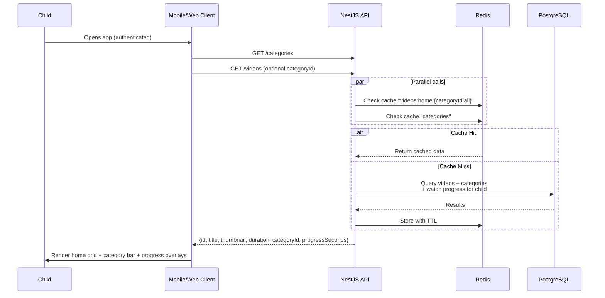
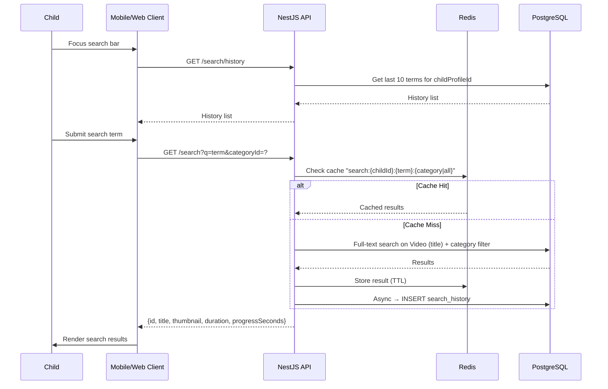
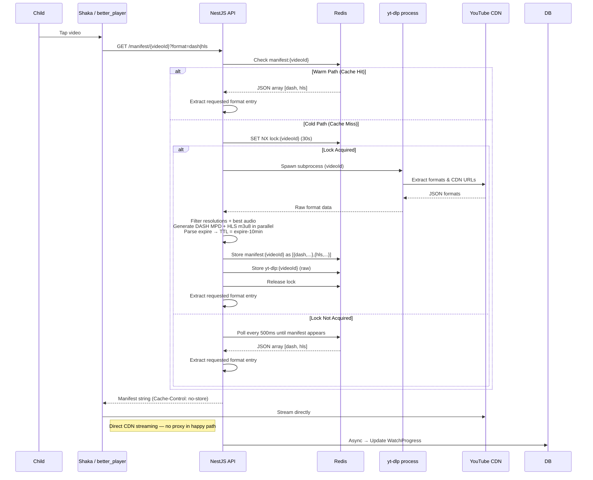
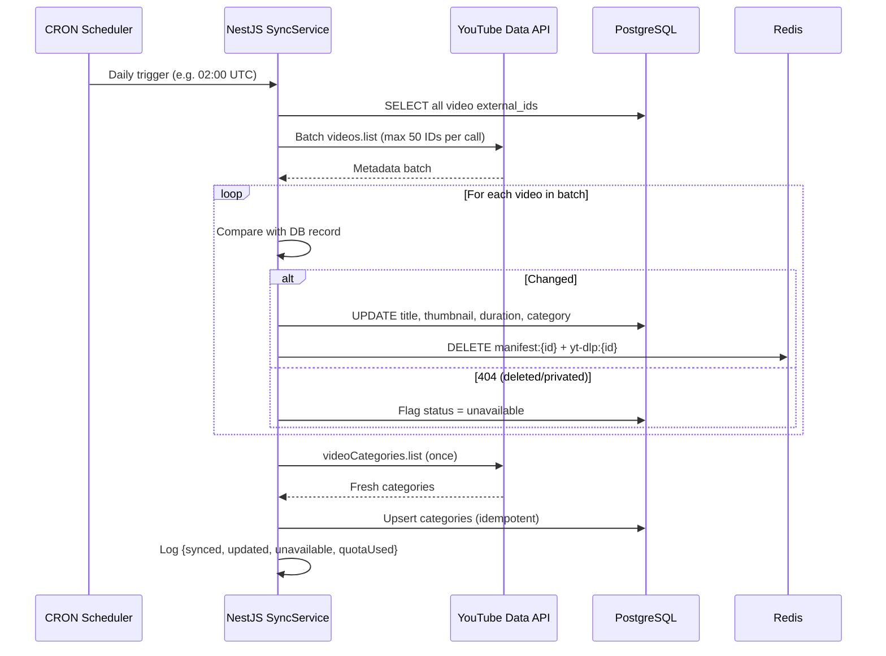
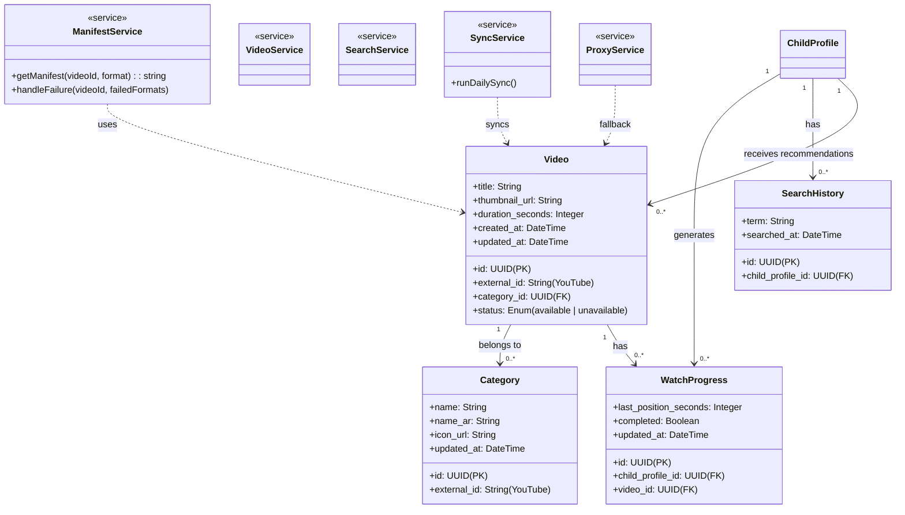

<div dir="rtl">

# وحدة المحتوى المرئي — المواصفات التقنية

---

## فهرس المحتويات

1. [نظرة عامة](#1-نظرة-عامة)
2. [مرجع الأدوات وواجهات البرمجة](#2-مرجع-الأدوات-وواجهات-البرمجة) _(قابل للطي)_
3. [البنية المعمارية](#3-البنية-المعمارية)
4. [مخططات التسلسل](#4-مخططات-التسلسل)
5. [مخطط الكيانات والفئات](#5-مخطط-الكيانات-والفئات)
6. [مواصفات الـ API الخارجية والتكامل](#6-مواصفات-الـ-api-الخارجية-والتكامل)
7. [الإطار القانوني والامتثال](#7-الإطار-القانوني-والامتثال)
8. [متطلبات النظام](#8-متطلبات-النظام)
9. [دليل النشر](#9-دليل-النشر)
10. [دليل التشغيل](#10-دليل-التشغيل)

---

## 1. نظرة عامة

تُنفّذ هذه الوحدة تجربة مشاهدة فيديو منقّحة وخالية من الإعلانات لمنصة مخصصة للأطفال. لا تعرض المنصة تجربة YouTube الخام، بل تقدّم مجموعة مصفّاة مسبقاً من محتوى YouTube مع إمكانية تحكّم كاملة للوالدَين.

يعمل النظام عبر طبقتَين منفصلتَين بوضوح:

**طبقة إدارة المحتوى (Content Management Layer)** — يقوم المشرفون والوالدان بتعبئة مكتبة الفيديو المنتقاة. تنشأ الفيديوهات من YouTube، لكنها تُفهرَس في قاعدة بيانات المنصة مع البيانات الوصفية (metadata) المُجلَبة عبر YouTube Data API. تحافظ مهمة CRON على تزامن هذه البيانات. هذه الطبقة خارج نطاق هذه الوحدة جزئياً، لكنها تؤثر بشكل مباشر على قرارات التشغيل.

**طبقة التشغيل (Playback Layer)** — هي جوهر هذه الوحدة. يتجاوز بث الفيديو كلياً الـ YouTube embed التقليدي. بدلاً من استخدام IFrame Player API، يستخرج `yt-dlp` روابط stream المباشرة من CDN، ويُنشئ الـ backend كلاً من manifest بصيغة DASH (`.mpd`) وصيغة HLS (`.m3u8`) في نفس عملية الاستخراج الباردة (cold-start)، ثم يبثّ مشغّل الـ frontend (مثل Shaka على الويب أو `better_player` على Flutter) مباشرةً من YouTube CDN. يُحدّد الـ client الصيغة المطلوبة عبر query parameter (الافتراضي هو `dash`)؛ وتُشترط HLS على iOS/macOS. هذا هو ما يُتيح التشغيل بلا إعلانات — إذ لا يُحمَّل مشغّل YouTube أصلاً، فلا تُحقَن إعلانات.

تُصمَّم البنية المعمارية حول `yt-dlp` لتحقيق المرونة: يُخزّن Redis الـ manifests مع TTL مشتقّة من وقت انتهاء صلاحية روابط CDN، ويمنع distributed lock الاستخراج المتزامن المكرَّر، ويقود نظام تتبّع الأعطال التنبيهات التشغيلية، كما يتعامل الـ proxy الاحتياطي لكل format مع أعطال CDN الجزئية، ويُخفّف IPv6 rotation من حظر IP.

---

## 2. مرجع الأدوات وواجهات البرمجة

<details>
<summary><strong>انقر للتوسيع — مرجع الأدوات وواجهات البرمجة</strong></summary>

### 2.1 YouTube Data API v3 (الرسمية)

**الغرض:** جلب البيانات الوصفية للفيديو (العناوين، الصور المصغّرة، الأوصاف، المدة، الفئة) وتحديث قائمة الفئات. لا تُستخدَم للبحث أو استرجاع روابط stream.

**المصادقة (Authentication):** API Key مرتبطة بـ YouTube Data API v3 في Google Cloud Console. تُخزَّن دائماً على جانب الـ server في ملف `.env`، ولا تُكشَف أبداً للـ client.

**الحصة (Quota):** 10,000 وحدة يومياً بشكل افتراضي. أبرز التكاليف:

- `videos.list` — **وحدة واحدة** لكل استدعاء، يدعم ما يصل إلى 50 معرّفاً في batch واحد
- `videoCategories.list` — **وحدة واحدة** لكل استدعاء
- `search.list` — **100 وحدة** لكل استدعاء (غير مستخدَمة في الإنتاج؛ موثَّقة للمرجع)

**سقف الحصة:** الحدّ اليومي البالغ 10,000 وحدة هو سقف صارم. يستلزم طلب الزيادة إجراء مراجعة امتثال من Google — وهو مسار متعدد الأسابيع ينطوي على مراجعة التزام التطبيق بشروط خدمة YouTube Data API. نظراً لطبيعة هذه المنصة، هذا المسار غير ممكن. يجب تصميم التطبيق بحيث لا يقترب أبداً من الحصة.

**المراجع:**

- [YouTube Data API v3 — البدء](https://developers.google.com/youtube/v3/getting-started)
- [حاسبة تكلفة الحصة](https://developers.google.com/youtube/v3/determine_quota_cost)
- [google-api-nodejs-client (عميل Node.js الرسمي)](https://github.com/googleapis/google-api-nodejs-client)
- [توثيق NestJS HttpModule](https://docs.nestjs.com/techniques/http-module)

---

### 2.2 yt-dlp

**الغرض:** استخراج روابط stream المباشرة من CDN لفيديوهات YouTube. هو الآلية الرئيسية للتشغيل بلا إعلانات. أداة Python CLI تُستدعى كـ subprocess من الـ NestJS backend.

**القيود:**

- أداة مُعادة هندستها؛ تعتمد على عدم تغيير الـ YouTube internal API. تحدث تغييرات جذرية (breaking changes) بشكل دوري دون إشعار مسبق ودون إصلاح تلقائي.
- تستلزم خدمة `bgutil-ytdlp-pot-provider` sidecar لمعالجة PO Token على IPs مراكز البيانات (راجع §3.4).
- ليست خدمة HTTP دائمة — كل استدعاء يُنشئ child process جديدة.

**المراجع:**

- [yt-dlp — مستودع GitHub](https://github.com/yt-dlp/yt-dlp)
- [yt-dlp — توثيق صيغة JSON output](https://github.com/yt-dlp/yt-dlp#output-template)
- [bgutil-ytdlp-pot-provider](https://github.com/brainbots/bgutil-ytdlp-pot-provider)

---

### 2.3 Redis

**الغرض:** تخزين مؤقت (caching) لـ DASH وHLS manifests (مُخزَّنة معاً كـ JSON array) ومخرجات yt-dlp الخام (للـ warm-path)، وقفل موزّع (distributed locking) يمنع الاستخراج البارد المتزامن، وعدّادات الأعطال (للفيديو والنظام)، وتخزين failover manifests.

**الإعداد المطلوب:** AOF persistence مع `appendfsync everysec`. Redis تبعية صارمة — بدونه يفشل الـ locking وتتفرّع طلبات الـ cold-path، مما يُنشئ عمليات yt-dlp متعددة لكل فيديو.

**المراجع:**

- [توثيق Redis Persistence](https://redis.io/docs/management/persistence/)
- [NestJS Cache Manager](https://docs.nestjs.com/techniques/caching)

---

### 2.4 Shaka Player (ويب)

**الغرض:** مشغّل DASH/HLS مفتوح المصدر من Google. يحمّل manifest بصيغة MPD الذي يُقدّمه الـ backend ويبثّ مباشرةً من روابط YouTube CDN المضمّنة فيه. يدعم adaptive bitrate والمحاولات المتعددة ومعالجة الأخطاء المخصصة.

**ملاحظة:** لا يوجد لـ Shaka wrapper رسمي لـ React، لكنه يتكامل بسهولة مع `useRef` على عنصر `<video>`. من بدائل مشغّلات الويب التي تدعم DASH: `video.js` مع إضافة `videojs-http-streaming`. الاختيار متروك لفريق الـ frontend؛ المتطلب هو دعم DASH (MPD). يجب على الـ web clients طلب `GET /manifest/{videoId}?format=dash` (أو حذف الـ parameter إذ `dash` هو الافتراضي).

**المراجع:**

- [Shaka Player — GitHub](https://github.com/shaka-project/shaka-player)
- [Shaka Player — التوثيق](https://shaka-project.github.io/shaka-player/docs/api/index.html)

---

### 2.5 better_player (Flutter / موبايل)

**الغرض:** إضافة Flutter تدعم تشغيل DASH وHLS مع adaptive bitrate واختيار المسار وصورة داخل صورة (picture-in-picture) وHTTP headers ودعم playlists. هي الخيار الموصى به لفريق Flutter في هذه الحالة.

**قيد iOS/macOS الحرج:** لا يدعم AVPlayer (المشغّل الأصلي لـ iOS/macOS في Flutter) صيغة DASH (MPD) بشكل أصلي. يجب على iOS/macOS clients طلب `GET /manifest/{videoId}?format=hls` للحصول على manifest بصيغة HLS (`.m3u8`). تُنشأ كلتا الصيغتَين خلال نفس عملية الاستخراج الباردة وتُخزَّنان معاً — لا تأخير إضافي لـ HLS على منصات Apple.

**المراجع:**

- [better_player — pub.dev](https://pub.dev/packages/better_player)
- [DASH مقابل HLS — نظرة عامة على MDN](https://developer.mozilla.org/en-US/docs/Web/Media/DASH_Adaptive_Streaming_for_HTML_5_Video)

---

### 2.6 YouTube IFrame Player API (بديل / مرجع احتياطي)

> **ملاحظة:** IFrame Player API **ليست** المنهج الأساسي. يستخدم النظام `yt-dlp` مع DASH/HLS manifests، مما يتجاوز مشغّل YouTube كلياً. يُحتفَظ بهذا القسم للمرجع فقط، في حال قيام الفريق بتقييم الرجوع إلى هذا النهج.

تُضمّن IFrame API مشغّل YouTube عبر وسم `<iframe>` يُتحكّم فيه بـ JavaScript. يُقدّم المشغّل المستضاف من YouTube والذي يتضمّن الإعلانات. التشغيل بلا إعلانات غير ممكن بهذا النهج.

**إخفاء التوصيات (نهج IFrame):** لا توفّر IFrame API طريقة مباشرة لإخفاء نافذة توصيات YouTube عند نهاية الفيديو. يحدّ الـ parameter `rel=0` من الاقتراحات للقناة ذاتها لكنه لا يُزيل النافذة. الحلّ الصحيح هو اعتراض حالة `ENDED` للمشغّل عبر `onStateChange` وعرض واجهة التوصيات الخاصة بالمنصة قبل ظهور النافذة. هذا غير ذي صلة في النهج الحالي مع `yt-dlp`.

**المراجع:**

- [YouTube IFrame Player API](https://developers.google.com/youtube/iframe_api_reference)
- [مرجع Player Parameters](https://developers.google.com/youtube/player_parameters)

</details>

---

## 3. البنية المعمارية

### 3.1 خريطة المكوّنات على المستوى العالي

```
Child / Parent
     │
     ▼
Mobile/Web Client
  (Shaka / better_player)
     │
     │  GET /manifest/{videoId}
     │  GET /videos, /search, /categories
     ▼
NestJS API
  ├── ManifestService   ──── yt-dlp subprocess ──── YouTube CDN
  ├── VideoService      ──── PostgreSQL
  ├── SearchService     ──── PostgreSQL + Redis
  ├── SyncService       ──── YouTube Data API
  └── ProxyService      ──── YouTube CDN (fallback only)
     │
     ▼
Redis  ◄──────────────── lock, cache, failure counters
     │
PostgreSQL ◄──────────── video library, categories, watch progress, search history
```

بعد تحميل الـ manifest، **يبثّ Shaka مباشرةً من YouTube CDN** — لا يكون الـ NestJS backend في مسار البثّ خلال التشغيل العادي. يُستخدَم الـ proxy فقط كملاذ أخير عند فشل روابط CDN المباشرة لصيغ بعينها.

---

### 3.2 تشغيل الفيديو — المسار البارد والمسار الدافئ

**صيغة تخزين الـ manifest في cache:** تُخزَّن الـ manifests في Redis كـ JSON array يحتوي على كلتا الصيغتَين، وتُنشآن معاً دائماً:

```json
[
  { "format": "dash", "manifest": "<MPD XML string>" },
  { "format": "hls", "manifest": "<M3U8 string>" }
]
```

يطلب الـ client الصيغة التي يحتاجها عبر `GET /manifest/{videoId}?format=dash|hls`. يكون الـ `format` parameter افتراضياً `dash`. يستخرج الـ backend ويُعيد فقط سلسلة manifest الصيغة المطلوبة من الـ array المُخزَّن.

**المسار الدافئ (Warm path — cache hit):** الـ manifest array للفيديو المطلوب موجود بالفعل في Redis. يقرأ الـ backend الـ array ويستخرج الصيغة المطلوبة ويُعيدها فوراً. الكُمون المستهدف: أقل من 200ms.

**المسار البارد (Cold path — cache miss):**

1. يحصل الـ backend على Redis lock (`SET NX EX 30` على `lock:{videoId}`) لمنع الاستخراجات المتزامنة.
2. يُنشأ `yt-dlp` subprocess بمعرّف الفيديو.
3. يُعيد yt-dlp الصيغ المتاحة وروابط CDN بصيغة JSON.
4. يُصفّي الـ backend إلى الدقات المستهدفة: `[144p, 240p, 360p, 480p, 720p, 1080p]` ويختار أفضل stream صوتي.
5. يُنشئ الـ backend كلتا الـ manifests بشكل متوازٍ من مخرجات yt-dlp نفسها:
   - DASH MPD (`.mpd`) بروابط CDN مباشرة.
   - HLS master playlist (`.m3u8`) بروابط CDN مباشرة.
6. يُحلَّل timestamp الانتهاء (`expire`) من روابط CDN لاشتقاق الـ Redis TTL (expire − 10 دقائق).
7. تُسلسَل (serialise) كلتا الـ manifests كـ JSON array وتُخزَّن تحت `manifest:{videoId}`. تُخزَّن مخرجات yt-dlp الخام تحت `yt-dlp:{videoId}`. يُحرَّر الـ lock.
8. يستخرج الـ backend الصيغة المطلوبة ويُعيدها للـ client.

الكُمون المستهدف للمسار البارد: أقل من 5 ثوانٍ.

---

### 3.3 معالجة الفشل والـ Fallback

يعمل مسار الفشل عبر مرحلتَين متمايزتَين: أعطال CDN المُبلَّغ عنها من مشغّل الـ frontend، وأعطال الـ proxy المُكتشَفة من الـ backend. المرحلة الثانية فقط هي التي تزيد العدّادات.

**المرحلة الأولى — فشل format على CDN (مُبلَّغ من الـ frontend):**

عندما يواجه المشغّل خطأ في الـ stream، يُعيد المحاولة داخلياً (3 محاولات، exponential backoff يبدأ بثانية واحدة). بعد استنفاد المحاولات لصيغة معيّنة، يُبلّغ الـ client بالفشل عبر `POST /video/{videoId}/failure` مع قائمة معرّفات الـ formats الفاشلة. لا يُزاد أيّ عدّاد في هذه المرحلة. يقوم الـ backend بـ:

1. قراءة `manifest:{videoId}` من Redis وإزالة تسلسل الـ JSON array.
2. في **كلٍّ** من مدخلَي DASH وHLS: استبدال روابط CDN لمعرّفات الـ formats الفاشلة بروابط proxy تشير إلى `/proxy/{videoId}/{formatId}`.
3. حفظ الـ array المُحدَّث كـ `failover:{videoId}` في Redis (يُحتفَظ بـ `manifest:{videoId}` الأصلي سليماً).
4. إعادة failover manifest للصيغة التي طلبها الـ client أصلاً.

تستمر الدقات العاملة في الوصول المباشر إلى CDN — تُحوَّل عبر proxy فقط معرّفات الـ formats الفاشلة، في كلتا نسختَي DASH وHLS من الـ failover manifest.

**المرحلة الثانية — فشل الـ Proxy (مُكتشَف من الـ backend):**

إذا فشل طلب format مُحوَّل عبر proxy إلى `/proxy/{videoId}/{formatId}` بدوره (403/410 من YouTube CDN)، يقوم الـ backend بـ:

1. زيادة `failures:{videoId}` في Redis.
2. حذف جميع keys الفيديو: `manifest:{videoId}` و`yt-dlp:{videoId}` و`failover:{videoId}`. مفتاح `failures:{videoId}` **لا يُحذَف**.
3. استدعاء yt-dlp مجدداً (cold start) لاستخراج روابط CDN جديدة.
4. إنشاء DASH وHLS manifests جديدة وتخزينها كـ JSON array تحت `manifest:{videoId}` والمخرجات الخام تحت `yt-dlp:{videoId}`.
5. إعادة الـ manifest الجديد بالصيغة التي طلبها الـ client أصلاً.

**عتبة الفشل لكل فيديو (Per-video failure threshold):**

إذا تجاوز `failures:{videoId}` العتبة المُعدَّة، يُسجَّل معرّف الفيديو في سجلّ أعطال IP (موقع مشترك يصل إليه كلٌّ من تطبيق NestJS وسكريبت تدوير IPv6 — راجع §3.6). يُزاد بعدها `yt-dlp:failures:count` العالمي.

**العتبة العالمية (Global failure threshold):**

إذا تجاوز `yt-dlp:failures:count` عتبته، يُخطَر المشرف بتوصية بتدوير الـ IP. إذا استمر المشرف في تلقّي إشعارات متكررة، فهذا يدلّ على عدم كفاية تدوير IP وحده ويستلزم تحقيقاً أعمق (تحديث yt-dlp، فحص poToken sidecar). يتّخذ المشرف الإجراء التصحيحي عبر لوحة التحكّم (admin panel) (راجع §3.6) — لا حاجة لأوامر Redis أو قاعدة بيانات مباشرة.

**إذا كان yt-dlp معطَّلاً كلياً وانتهى صلاحية cache:**

تعرض المنصة رسالة تدهور الخدمة: قسم الفيديو غير متاح مؤقتاً، لكن الميزات الأخرى (القصص، الألعاب) تبقى في متناول المستخدم. لا يُعرَض أيّ محتوى فيديو حتى يتعافى yt-dlp.

---

### 3.4 PO Token Sidecar (كشف الـ Bot)

تستخدم YouTube آلية PO Tokens (Proof-of-Origin Tokens) كآلية تحقّق مشفّر للتمييز بين حركة المرور الآلية والطلبات المشروعة. تكون IPs مراكز البيانات عرضة بشكل خاص لتشغيل حواجز "Sign in to confirm you're not a robot"، مما يُفشل yt-dlp بصرف النظر عن تدوير IP.

يتكامل `bgutil-ytdlp-pot-provider` plugin مع yt-dlp عبر PO Token Provider Framework ويسترجع tokens من HTTP server مخصص (متاح كـ Docker image جاهز). يُوصى بتشغيله كـ sidecar container منفصل. إذا تعذّر ذلك، يمكن أيضاً تشغيل HTTP server كخدمة داخل نفس container yt-dlp على منفذ localhost — يدعم Docker image كلا وضعَي النشر. يكون TTL الافتراضي لـ cache الـ token 6 ساعات ويُعدَّل عبر `TOKEN_TTL`.

**هذا مختلف تماماً عن حظر IP.** يؤثر حظر IP على الاستخراجات من عنوان IP محدد. تُفشل أعطال PO Token جميع الاستخراجات بصرف النظر عن IP في حال شدّدت YouTube تطبيق كشف الـ bot. يمكن أن يحدث كلا وضعَي الفشل في آنٍ واحد أو بشكل مستقل، ويجب تتبّعهما كإشارتَين تشغيليتَين منفصلتَين.

---

### 3.5 Cookies والمحتوى المقيَّد بالسن

لا تُلزَم الـ cookies للفيديوهات العامة العادية وليست جزءاً من الإعداد التشغيلي المعتاد. تصبح ضرورية للمحتوى المقيَّد بالسن وللفيديوهات خلف بوابة "sign in to confirm" من YouTube — التي تُستدعى بشكل متزايد بواسطة IPs الـ server المُعلَّمة بحركة مرور آلية.

بما أن المنصة تتحكّم في الفيديوهات المقبولة في المكتبة، يمكن استبعاد المحتوى المقيَّد بالسن على مستوى إدارة المحتوى. غير أن فيديو كان متاحاً من قبل قد يُقيَّد لاحقاً من قِبَل YouTube دون إشعار. يجب أن تكتشف مهمة CRON للمزامنة هذا وتُعلّم الفيديو كغير متاح. يستحقّ بناء التحقق من رابط الـ URL في سير عمل إضافة الفيديو (عند إضافة رابط YouTube من قِبَل المشرفين أو الوالدَين) للتحقق من إمكانية الوصول عبر yt-dlp قبل قبوله في المكتبة.

---

### 3.6 تدوير IPv6

يعمل تدوير IPv6 كـ script على مستوى الـ host، مستقلاً عن التطبيق وفق جدوله الزمني العادي. غير أن تطبيق NestJS وسكريبت التدوير يشتركان في الوصول إلى سجلّ أعطال IP مشترك — ملف ثابت أو مخزن خفيف الوزن على الـ host — مما يُتيح لسكريبت التدوير اتخاذ قرارات مدروسة حول ضرورة التدوير استناداً إلى إشارات الفشل من التطبيق، بدلاً من التدوير بشكل أعمى وفق مؤقّت.

يُسهم تطبيق NestJS في هذا السجلّ المشترك عبر:

- تسجيل عنوان IP الصادر الحالي وقت الاستخراج (عبر `ip route get` أو ما يعادله عند بدء العملية).
- إضافة مدخل فشل (معرّف الفيديو، الطابع الزمني، IP الحالي، نوع الخطأ) في كل مرة تتجاوز فيها عتبة الفشل لفيديو ما ويُزاد `yt-dlp:failures:count`.

يقرأ سكريبت التدوير هذا السجلّ قبل تقرير ضرورة تدوير مبكر. في التشغيل المجدوَل، إذا أشارت مدخلات الفشل الأخيرة إلى IP الحالي، يتمّ التدوير. إذا توقفت مدخلات الفشل (مؤشّر على التعافي)، يمكن تخطّي التدوير.

**لا يُلزَم المشرف بأيّ وصول مباشر لـ Redis أو قاعدة البيانات** لإدارة هذا. جميع إعادات التعيين وإشارات التدوير مكشوفة عبر لوحة التحكّم (admin panel):

- **إعادة تعيين عدّادات الفشل (Reset failure counters)** — يمسح `yt-dlp:failures:count` ومدخلات `failures:{videoId}` للفيديوهات المتأثرة، ومدخلات سجلّ الفشل للـ IP الحالي.
- **تشغيل تدوير IP يدوي (Trigger manual IP rotation)** — يُرسل إشارة لسكريبت التدوير للتنفيذ الفوري ويُعيد تعيين العدّادات.
- **عرض الحالة الحالية (View current state)** — يُظهر الـ IP الصادر الحالي، مدخلات سجلّ الفشل الأخيرة، وحالة النظام (`operational` / `degraded` / `down`).

**Sidecar fallback:** إذا تعذّر تشغيل poToken sidecar container مخصص جانباً مع yt-dlp (مثل البيئات ذات الموارد المحدودة)، يمكن تشغيل `bgutil-ytdlp-pot-provider` بوضع HTTP server داخل نفس container yt-dlp. Docker image للـ provider مكتفٍ بذاته ولا يستلزم container منفصلاً — يمكن تجميعه كعملية داخل container yt-dlp مع إعداد تطبيق NestJS للوصول إليه على منفذ localhost.

---

## 4. مخططات التسلسل

### قائمة المخططات

| #   | الاسم                                | الملف                                              |
| --- | ------------------------------------ | -------------------------------------------------- |
| 1   | دخول المستخدم وتحميل الشاشة الرئيسية | `diagrams/visual_content/01_home_load.svg`         |
| 2   | سير عمل البحث                        | `diagrams/visual_content/02_search.svg`            |
| 3   | تشغيل الفيديو — المسار البارد        | `diagrams/visual_content/03_playback_cold.svg`     |
| 4   | تشغيل الفيديو — الفشل والـ Fallback  | `diagrams/visual_content/04_playback_fallback.svg` |
| 5   | مهمة CRON لمزامنة البيانات الوصفية   | `diagrams/visual_content/05_cron_sync.svg`         |

---

<details>
<summary><strong>المخطط 1 — دخول المستخدم وتحميل الشاشة الرئيسية (وصف التسلسل)</strong></summary>

**المشاركون:** `Child`، `Mobile/Web Client`، `NestJS API`، `PostgreSQL DB`، `Redis`

**التسلسل:**

1. يفتح `Child` التطبيق (يُفتَرَض وجود جلسة مُصادَق عليها — المصادقة خارج نطاق هذه الوحدة).
2. يُرسل `Client` طلب `GET /categories` — يتبع نفس نمط Redis-first كقائمة الفيديو (طلب منفصل، يمكن أن يكون متوازياً).
3. يُرسل `Client` طلب `GET /videos` مع `categoryId` filter اختياري (الافتراضي: none).
4. يفحص `NestJS` ذاكرة `Redis` للاستجابة المُخزَّنة تحت المفتاح `videos:home:{categoryId|all}`.
5. **[alt: Cache hit]** إعادة قائمة الفيديو المُخزَّنة ← الانتقال إلى الخطوة 8.
6. **[alt: Cache miss]** يستعلم `NestJS` من `PostgreSQL` عن الفيديوهات بربطها مع `Category` و`WatchProgress` لملف الطفل الحالي. يستبعد الفيديوهات التي شاهد فيها جميع المحتوى المتاح.
7. يكتب `NestJS` النتيجة إلى `Redis` مع TTL مناسب.
8. تجميع الاستجابة: `{ id, title, thumbnail, duration, categoryId, progressSeconds }`.
9. يعرض `Client` شبكة الشاشة الرئيسية مع شريط تصفية الفئات ومؤشرات تقدّم المشاهدة.



</details>

---

<details>
<summary><strong>المخطط 2 — سير عمل البحث (وصف التسلسل)</strong></summary>

**المشاركون:** `Child`، `Client`، `NestJS API`، `PostgreSQL DB`، `Redis`

**التسلسل:**

1. يُركّز `Child` على شريط البحث — يجلب `Client` طلب `GET /search/history` ويعرض مصطلحات البحث السابقة لملف الطفل الحالي (تُقرأ من قاعدة البيانات، لا حاجة لـ cache).
2. يُرسل `Child` مصطلح بحث.
3. يُرسل `Client` طلب `GET /search?q={term}&categoryId={optional}`.
4. يفحص `NestJS` ذاكرة `Redis` للمفتاح `search:{childProfileId}:{normalizedTerm}:{categoryId|all}`.
5. **[alt: Cache hit]** إعادة النتائج المُخزَّنة ← الانتقال إلى الخطوة 8.
6. **[alt: Cache miss]** يستعلم `NestJS` من `PostgreSQL` — بحث نصي كامل أو LIKE على `title` داخل مكتبة الفيديو المنتقاة؛ يُطبَّق `categoryId` filter إذا وُجد.
7. يكتب `NestJS` النتيجة إلى `Redis` مع TTL. يكتب مصطلح البحث إلى جدول `search_history` في `PostgreSQL` كـ side effect غير متزامن (لا يحجب الاستجابة).
8. يعرض `Client` نتائج البحث: `{ id, title, thumbnail, duration, progressSeconds }`.



</details>

---

<details>
<summary><strong>المخطط 3 — تشغيل الفيديو: المسار البارد (وصف التسلسل)</strong></summary>

**المشاركون:** `Child`، `Client (Shaka / better_player)`، `NestJS API`، `Redis`، `yt-dlp process`، `YouTube CDN` (خارجي)

**التسلسل:**

1. يضغط `Child` على فيديو.
2. يُرسل `Client` طلب `GET /manifest/{videoId}?format=dash|hls` (الافتراضي `dash`؛ يُرسل iOS/macOS clients الطلب بـ `format=hls`).
3. يفحص `NestJS` ذاكرة `Redis` للمفتاح `manifest:{videoId}`.
4. **[alt: المسار الدافئ — cache hit]** إزالة تسلسل JSON array، استخراج مدخل الصيغة المطلوبة، إعادة الـ manifest ← الانتقال إلى الخطوة 15.
5. **[alt: المسار البارد — cache miss]**
6. يحاول `NestJS` الحصول على `SET NX EX 30` على `lock:{videoId}` في `Redis`.
7. **[alt: تمّ الحصول على الـ Lock]** تشغيل `yt-dlp` subprocess لمعرّف الفيديو.
8. **[alt: لم يُحصَل على الـ Lock — طلب متزامن]** الاستعلام من `Redis` كل 500ms لمدة تصل إلى 25 ثانية انتظاراً لظهور `manifest:{videoId}`، ثم استخراج الصيغة المطلوبة وإعادتها.
9. يُعيد `yt-dlp` JSON بالصيغ المتاحة وروابط CDN.
10. يُصفّي `NestJS` إلى الدقات المستهدفة `[144p, 240p, 360p, 480p, 720p, 1080p]`؛ يختار أفضل stream صوتي.
11. يُنشئ `NestJS` كلتا الـ manifests بشكل متوازٍ من مخرجات yt-dlp نفسها: DASH MPD وHLS master playlist، كلاهما بروابط CDN مباشرة. يُحلَّل timestamp `expire` من رابط CDN ← TTL = `expire − 10 دقائق`.
12. يُسلسل `NestJS` `[{"format":"dash","manifest":"..."},{"format":"hls","manifest":"..."}]` ويُخزّنه كـ `manifest:{videoId}` في Redis. يُخزّن المخرجات الخام كـ `yt-dlp:{videoId}`. يُحرَّر الـ lock.
13. يستخرج `NestJS` مدخل الصيغة المطلوبة من الـ array.
14. يُعيد `NestJS` سلسلة الـ manifest مع `Cache-Control: no-store`.
15. يحمّل `Client` الـ manifest ويبدأ البثّ **مباشرةً** من `YouTube CDN`. لا يحدث proxy في المسار السعيد.
16. يحفظ `NestJS` سجلّ `WatchProgress` إلى `PostgreSQL` (مدخل جديد أو تحديث timestamp) — بشكل غير متزامن، لا يحجب التشغيل.



</details>

---

<details>
<summary><strong>المخطط 4 — تشغيل الفيديو: الفشل والـ Fallback (وصف التسلسل)</strong></summary>

**المشاركون:** `Client (Shaka / better_player)`، `NestJS API`، `Redis`، `yt-dlp process`، `YouTube CDN` (خارجي)، `IP Failure Log` (ملف/مخزن مشترك على الـ host)

**التسلسل — المرحلة الأولى: فشل CDN (مُبلَّغ من الـ frontend):**

1. يواجه المشغّل خطأ في stream على صيغة واحدة أو أكثر.
2. يُعيد المشغّل المحاولة داخلياً — 3 محاولات، exponential backoff يبدأ بثانية واحدة. داخلي للـ client؛ لا يشمل الـ server.
3. بعد استنفاد المحاولات، يُرسل `Client` طلب `POST /video/{videoId}/failure` مع `{ formatIds: [failedIds] }`. **لا يُزاد أيّ عدّاد.**
4. يقرأ `NestJS` ذاكرة `manifest:{videoId}` من `Redis` ويُزيل تسلسل JSON array.
5. في **كلٍّ** من مدخلَي DASH وHLS في الـ array: يستبدل `NestJS` روابط CDN لمعرّفات الـ formats الفاشلة بروابط proxy (`/proxy/{videoId}/{formatId}`).
6. يحفظ `NestJS` الـ array المُحدَّث كـ `failover:{videoId}` في `Redis`. يُحتفَظ بـ `manifest:{videoId}` الأصلي.
7. يُعيد `NestJS` failover manifest للصيغة التي طلبها الـ client أصلاً.
8. يحمّل `Client` failover manifest. تستمر الدقات العاملة في البثّ مباشرةً من `YouTube CDN`؛ معرّفات الـ formats الفاشلة تذهب إلى `NestJS ProxyService`.

**التسلسل — المرحلة الثانية: فشل الـ Proxy (مُكتشَف من الـ backend):**

9. يستقبل `NestJS ProxyService` طلب stream مُحوَّل لصيغة فاشلة ويُعيد توجيهه إلى `YouTube CDN`.
10. يُعيد `YouTube CDN` 403/410.
11. يزيد `NestJS` العدّاد `failures:{videoId}` في `Redis`.
12. يحذف `NestJS` `manifest:{videoId}` و`yt-dlp:{videoId}` و`failover:{videoId}` من `Redis`. مفتاح `failures:{videoId}` **لا يُحذَف**.
13. يُشغّل `NestJS` استخراج yt-dlp بالمسار البارد (يحصل على lock، يُشغّل subprocess، يُنشئ DASH + HLS array جديداً).
14. يُخزّن `NestJS` JSON array الجديد كـ `manifest:{videoId}` والمخرجات الخام كـ `yt-dlp:{videoId}` في `Redis`.
15. يُعيد `NestJS` الـ manifest الجديد بالصيغة التي طلبها الـ client أصلاً.

**[opt: تجاوز عتبة الفيديو]** 16. إذا تجاوز `failures:{videoId}` العتبة المحدّدة لكل فيديو: يُضيف `NestJS` مدخلاً إلى `IP Failure Log` (معرّف الفيديو، timestamp، IP الصادر الحالي، نوع الخطأ). يزيد `yt-dlp:failures:count` في `Redis`.

**[opt: تجاوز العتبة العالمية]** 17. إذا تجاوز `yt-dlp:failures:count` العتبة العالمية: يُرسل `NestJS` إشعاراً للمشرف بتوصية تدوير IP مع رابط للوحة التحكّم. يتّخذ المشرف الإجراء التصحيحي عبر لوحة التحكّم — لا حاجة لوصول مباشر لـ Redis.

```mermaid
sequenceDiagram
    participant Client as Shaka / better_player
    participant API as NestJS API
    participant Redis
    participant YTDLP as yt-dlp
    participant CDN as YouTube CDN
    participant Log as IP Failure Log (host)

    Client->>CDN: Stream fails on one or more format IDs
    note right of Client: Internal retry (3×, exponential backoff)
    Client->>API: POST /video/{videoId}/failure {formatIds: [...]}

    %% Stage 1 – CDN failure (no counter increment)
    API->>Redis: Read manifest:{videoId} → JSON array [dash, hls]
    API->>API: Replace failed formatId URLs with /proxy/... in BOTH dash and hls entries
    API->>Redis: Save failover:{videoId} as updated array [dash, hls]
    API-->>Client: Failover manifest (requested format; working formats stay on CDN)

    Client->>API: Proxy request /proxy/{videoId}/{formatId}
    API->>CDN: Forward request

    %% Stage 2 – Proxy failure (counter incremented)
    alt Proxy returns 403/410
        API->>Redis: Increment failures:{videoId}
        API->>Redis: Evict manifest:{videoId} + yt-dlp:{videoId} + failover:{videoId}
        API->>YTDLP: Cold-path re-extraction (lock + subprocess)
        YTDLP-->>API: Fresh format data
        API->>API: Generate fresh DASH MPD + HLS m3u8
        API->>Redis: Store manifest:{videoId} as fresh [{dash,...},{hls,...}]
        API->>Redis: Store yt-dlp:{videoId} (raw)
        API-->>Client: Fresh manifest (requested format)
    end

    opt Per-video threshold crossed
        API->>Log: Append failure (videoId, IP, timestamp, errorType)
        API->>Redis: Increment yt-dlp:failures:count
    end

    opt Global threshold crossed
        API->>Admin: Notification + link to admin panel
    end
```

</details>

---

<details>
<summary><strong>المخطط 5 — مهمة CRON لمزامنة البيانات الوصفية (وصف التسلسل)</strong></summary>

**المشاركون:** `CRON Scheduler`، `NestJS API (SyncService)`، `YouTube Data API` (خارجي)، `PostgreSQL DB`، `Redis`

**التسلسل:**

1. يُشغّل `CRON Scheduler` `SyncService.run()` وفق الجدول الزمني (يومياً موصى به).
2. يستعلم `SyncService` من `PostgreSQL` عن جميع معرّفات الفيديو في مكتبة المنصة.
3. يُجمّع `SyncService` المعرّفات في مجموعات من 50؛ يستدعي `videos.list?part=snippet,contentDetails&id={batch}&key={API_KEY}` على `YouTube Data API` (وحدة واحدة لكل batch من 50 فيديو).
4. لكل فيديو في الاستجابة:
   - مقارنة البيانات الوصفية المُعادة مع سجلّ قاعدة البيانات.
   - إذا تغيّرت: تحديث `title` و`thumbnail_url` و`duration_seconds` و`category_id` في `PostgreSQL`.
   - إذا أعاد الفيديو 404 (محذوف أو خاص على YouTube): تعليم الفيديو كـ `unavailable` في قاعدة البيانات. لا حذف للسجلّ.
5. يستدعي `SyncService` `videoCategories.list` مرة واحدة في كل تشغيل للمزامنة لتحديث قائمة الفئات في `PostgreSQL` (upsert غير محدود).
6. لأيّ فيديو تغيّرت بياناته الوصفية: حذف `manifest:{videoId}` و`yt-dlp:{videoId}` من `Redis` لإجبار الاستخراج عند التشغيل التالي (قد تشير الـ manifests القديمة إلى محتوى منتهي الصلاحية).
7. تسجيل نتيجة المزامنة: `{ synced, updated, unavailable, quotaUsed }`.



</details>

---

## 5. مخطط الكيانات والفئات

| المخطط                                  | الملف                                         |
| --------------------------------------- | --------------------------------------------- |
| مخطط الكيانات / الفئات (المحتوى المرئي) | `diagrams/visual_content/06_class_entity.svg` |

<details>
<summary><strong>الكيانات والحقول الرئيسية لهذه الوحدة</strong></summary>

**Video**

- `id`، `external_id` (معرّف فيديو YouTube)، `title`، `thumbnail_url`، `duration_seconds`، `category_id`، `status` (`available` | `unavailable`)، `created_at`، `updated_at`

**Category**

- `id`، `external_id` (معرّف فئة YouTube)، `name`، `updated_at`

**WatchProgress**

- `id`، `child_profile_id`، `video_id`، `last_position_seconds`، `completed` (boolean)، `updated_at`

**SearchHistory**

- `id`، `child_profile_id`، `term`، `searched_at`

**SystemStatus** (أو يُدار عبر Redis `yt-dlp:failures:count`)

- `failures_count`، `last_failure_at`، `state` (`operational` | `degraded` | `down`)

</details>

<details>
<summary><strong>المخطط</strong></summary>



</details>

---

## 6. مواصفات الـ API الخارجية والتكامل

### 6.1 YouTube Data API v3 (الرسمية)

**الغرض:** استرجاع البيانات الوصفية ومزامنة الفئات. لا تُستخدَم لاستخراج روابط stream أو البحث.

**المصادقة:** API Key على جانب الـ server في `.env`. جميع الاستدعاءات تُجرى من NestJS — لا تُكشَف المفتاح للـ client أبداً.

```
Frontend → NestJS API → YouTube Data API
```

**الـ Endpoints المستخدَمة في الإنتاج:**

`GET /videos?part=snippet,contentDetails&id={id1,id2,...}&key={API_KEY}`

- تجلب البيانات الوصفية لما يصل إلى 50 معرّف فيديو في استدعاء واحد.
- التكلفة: وحدة واحدة لكل استدعاء بصرف النظر عن عدد المعرّفات (التجميع في batches ضروري).
- تُعيد: `snippet` (العنوان، الوصف، الصور المصغّرة، channelId، publishedAt) و`contentDetails` (المدة، الأبعاد).

`GET /videoCategories?part=snippet&regionCode=US&key={API_KEY}`

- تجلب قائمة فئات فيديو YouTube.
- التكلفة: وحدة واحدة لكل استدعاء.
- تُستدعى مرة واحدة في كل تشغيل مزامنة CRON.

**إدارة الحصة (Quota management):**

- يجب تجميع جميع استدعاءات `videos.list` في مجموعات من 50 معرّفاً. مهمة CRON لمزامنة 500 فيديو تستخدم 10 وحدات quota فقط.
- سقف الحصة هو 10,000 وحدة/يوم. طلب الزيادة يستلزم مراجعة امتثال Google غير الممكنة لهذه المنصة. يجب ألا يعتمد النظام على تجاوز هذا الحدّ.
- يجب تنفيذ circuit breaker: إذا اقترب `quotaUsed` من الحدّ اليومي (عتبة قابلة للإعداد، مثلاً 9,000 وحدة)، يجب أن تتوقف مهمة CRON وتُخطر المشرفين بدلاً من الفشل الصامت.

**Endpoints موثَّقة للمرجع (غير مستخدَمة في التطبيق الحالي):**

<details>
<summary>search.list (مرجع فقط)</summary>

`GET /search?part=snippet&q={query}&type=video&key={API_KEY}`

- التكلفة: **100 وحدة لكل استدعاء** — أغلى عملية. غير مستخدَمة؛ البحث يُجرى على قاعدة بيانات المنصة.
- موثَّقة في حال تقييم الفريق لنهج بحث هجين مستقبلاً.

`GET /playlistItems?part=snippet&playlistId={id}&key={API_KEY}`

- تسترجع الفيديوهات داخل playlist لاستيعاب جماعي من قِبَل المشرفين.
- كل مدخل يحتوي على `snippet.resourceId.videoId`.
- يُعالَج التصفّح (pagination) عبر `pageToken`.

</details>

---

### 6.2 طبقة استخراج الـ Stream (yt-dlp)

**الغرض:** استخراج روابط CDN المباشرة لـ `.m4a` (صوت) و`.mp4`/`.webm` (فيديو) من YouTube وإنشاء DASH/HLS manifests.

**مسار البيانات (المسار السعيد):**

1. يطلب الـ client `GET /manifest/{videoId}?format=dash|hls` (الافتراضي `dash`).
2. يحصل NestJS على Redis lock ويُشغّل `yt-dlp` subprocess.
3. يستعلم yt-dlp (بمساعدة poToken sidecar) من YouTube عبر عنوان IPv6 من مجموعة التدوير.
4. يُعيد yt-dlp قائمة JSON بصيغ الـ CDN URLs لكل دقة.
5. يُنشئ NestJS كلتا الـ manifests بشكل متوازٍ من مخرجات yt-dlp نفسها: DASH MPD (`.mpd`) وHLS master playlist (`.m3u8`)، كلاهما بروابط CDN مباشرة.
6. تُسلسَل معاً كـ `[{"format":"dash","manifest":"..."},{"format":"hls","manifest":"..."}]` وتُخزَّن في Redis مع TTL مشتقّ من الـ `expire` parameter لـ CDN ناقصاً عشر دقائق كـ هامش أمان.
7. يستخرج NestJS الصيغة المطلوبة من الـ array ويُعيدها للـ client. يبثّ Shaka / better_player مباشرةً من CDN.

**التفاوض على الصيغة (Format negotiation):** يُحدّد الـ client `?format=dash` (الافتراضي، لـ Android والويب) أو `?format=hls` (مطلوب لـ iOS/macOS إذ لا يدعم AVPlayer صيغة DASH بشكل أصلي). تُنشأ كلتا الصيغتَين وتُخزَّنان دائماً خلال cold-start — لا تكلفة إضافية من yt-dlp ولا عقوبة كُمون لأيٍّ منهما.

**صيغ الـ stream المتوقَّعة:**

- فيديو: `mp4` (H.264) واختيارياً `webm` (VP9/AV1) بدقات متعددة.
- صوت: `m4a` (AAC)، وأحياناً `webm` (Opus).
- يُفضَّل استخدام H.264 video streams لأقصى توافق عبر كلٍّ من DASH وHLS manifests.

**Proxy fallback:**

- يُفعَّل فقط للصيغ التي فشل تسليمها عبر CDN.
- يجلب NestJS bytes الـ stream الخام من YouTube CDN ويُحوّلها للـ client عبر proxy.
- هذا ملاذ أخير — يزيد بشكل كبير من bandwidth الـ backend ويجب ألا يكون المسار الأساسي.

---

## 7. الإطار القانوني والامتثال

> ⚠️ يعكس هذا القسم سياقاً مدروساً وليس مشورة قانونية. للمنتجات التجارية ذات المستخدمين الدافعين، استشر محامياً مؤهَّلاً.

### 7.1 اعتبارات شروط الخدمة (Terms of Service)

يُعدّ الوصول إلى YouTube عبر واجهات غير قياسية أو حجب الإعلانات أو التحايل على أنظمة YouTube انتهاكاً تقنياً لشروط خدمة YouTube. تُقدَّم هذه المنصة كـ **أداة proxy خاصة وأداة رقابة أبوية** لا كمنتج تجاري، مما يُخفّف — لكن لا يُلغي — خطر التقاضي المباشر.

**آليات التطبيق التي يمكن لـ YouTube تطبيقها دون محكمة:**

- **حظر IP** على مستوى البنية التحتية، مما يُسبب انقطاعاً في الخدمة دون إشعار.
- **خطابات وقف وكفّ (Cease-and-desist)**، التي تفرض تكاليف قانونية ومخاطر انقطاع حتى لو كانت غير قابلة للتنفيذ في نهاية المطاف.
- **إنهاء الحساب/الخدمة** إذا ارتبطت البنية التحتية بحسابات Google.

**السوابق القانونية المعروفة:** وجدت المحاكم الأمريكية في قضايا (_hiQ v. LinkedIn_، _Van Buren_) عموماً أن scraping البيانات المتاحة للعموم لا ينتهك قانون CFAA. غير أن YouTube يمكنها متابعة مطالبات خرق العقد أو حقوق النشر، أو تطبيق التطبيق التقني (حظر IP) دون أي إجراء قانوني. انتهاك الـ ToS لا يساوي كسر القانون، لكن المخاطر العملية حقيقية.

**استخدام YouTube Data API الرسمية:** يجب أن تمتثل استدعاءات الـ API لسياسة مطوّري Google. يُحظَر بيع أو إعادة توزيع بيانات الـ API، أو استخدام بياناتها لتدريب نماذج الذكاء الاصطناعي.

### 7.2 الخصوصية وسلامة الأطفال (COPPA / GDPR-K)

بما أن الجمهور المستهدف هو الأطفال، يجب أن تُطبّق المنصة معايير حماية بيانات مرتفعة:

- **سياسة عدم التتبّع:** لا تُجمَع أيّ PII (معلومات تعريف شخصية) من ملفات الأطفال. لا تُرسَل أيّ بيانات سلوكية إلى Google أو متتبّعين من جهات خارجية.
- **تقليص البيانات:** تُدير حسابات الوالدَين "القوائم المسموح بها"، لكن بيانات تفاعل الطفل (تقدّم المشاهدة، سجل البحث) تُخزَّن محلياً على server المنصة ولا تُشارَك خارجياً.
- **الامتثال لـ COPPA:** تبقى أوزان التوصيات وإحصاءات الاستخدام محلية للـ server. لا معرّفات إعلانات ولا تتبّع عبر المواقع.
- **التوافق مع GDPR-K:** إذا استهدفت المنصة مستخدمين في الاتحاد الأوروبي، تنطبق نفس المبادئ. يجب توثيق آليات موافقة الوالدَين بشكل منفصل.

### 7.3 الملكية الفكرية

لا يستضيف النظام أيّ محتوى ولا يُعيد توزيعه. يعمل كـ **dynamic manifest generator** — روابط CDN المضمَّنة في الـ manifest تشير إلى servers YouTube نفسها. تتدفق حركة مرور YouTube CDN مباشرةً من الـ client إلى بنية YouTube التحتية؛ لا تُخزّن المنصة أو تُعيد تقديم bytes الفيديو (إلا بشكل عابر في مسار الـ proxy الاحتياطي).

**إطار الاستخدام العادل (Fair use):** يوفّر المشروع "غلاف إمكانية الوصول والسلامة"، مُقدّماً واجهة تحويلية للمحتوى العام الموجود. إزالة الإعلانات هي نقطة الانكشاف القانونية الرئيسية.

**حقوق نشر المحتوى:** المحتوى المُبثّ (فيديو، صوت) مملوك للمبدعين ومرخَّص لـ YouTube. انكشاف المنصة القانوني في آلية الوصول، لا في استضافة المحتوى. Proxying يزيد الانكشاف بشكل ملحوظ — يجب أن يبقى ملاذاً أخيراً لا مساراً اعتيادياً.

**GPL v3 (yt-dlp):** yt-dlp مرخَّص بـ Unlicense (ملك عام). أيّ مكوّنات مرخَّصة بـ GPL في الـ stack (مثلاً إضافة Piped لاحقاً) لن تستلزم مصدراً مفتوحاً للـ NestJS backend عند الاستخدام كـ SaaS، إذ يُشغَّل copyleft في GPL بالتوزيع لا بالاستخدام على الـ server.

---

## 8. متطلبات النظام

### المتطلبات الوظيفية (FR)

**FR1: اكتشاف المحتوى والتنقية**

- **FR1.1 — بحث المكتبة:** يجب أن يُتيح النظام للمستخدمين البحث فقط داخل قاعدة البيانات المنتقاة. يجب أن تشمل نتائج البحث العنوان والمدة ومؤشر تقدّم المشاهدة.
- **FR1.2 — تصفية الفئات:** يجب أن تعرض الشاشة الرئيسية شريط فئات أفقياً متزامناً مع `videoCategories` من YouTube. اختيار فئة يجب أن يُصفّي الفيديوهات المرئية وفقاً لذلك.
- **FR1.3 — سجلّ البحث:** يجب أن يُخزّن النظام ويعرض آخر 10 مصطلحات بحث لكل ملف طفل لتسهيل إعادة الاكتشاف السريع.
- **FR1.4 — التحكّم في التوصيات:** يجب أن يعرض النظام التوصيات فقط من مكتبة المنصة المنتقاة. يجب منع عرض نوافذ توصيات YouTube الأصلية عند نهاية الفيديو بشكل صريح.
- **FR1.5 — إعطاء الأولوية للفيديوهات غير المشاهَدة:** يجب أن يتجنّب النظام عرض الفيديوهات المشاهَدة سابقاً فقط. يجب أن تراعي استعلامات الشاشة الرئيسية سجلّ المشاهدة وتضمن أولوية المحتوى غير المشاهَد.

**FR2: تجربة تشغيل الفيديو**

- **FR2.1 — البثّ بلا إعلانات:** يجب أن يوفّر النظام تجربة تشغيل خالية من الإعلانات باستخراج روابط stream المباشرة وتقديمها عبر DASH/HLS manifest مخصص.
- **FR2.2 — أدوات التحكّم بالتشغيل:** يجب أن يدعم المشغّل أدوات التحكّم القياسية: تشغيل، إيقاف مؤقت، تخطّي (scrubbing)، صوت، وتبديل ملء الشاشة.
- **FR2.3 — التنقل في القائمة:** يجب أن يوفّر المشغّل زرَّي "التالي" و"السابق" للتنقل في القائمة المصفّاة الحالية أو playlist.
- **FR2.4 — استئناف التشغيل:** يجب أن يحفظ النظام موضع تشغيل الطفل (`last_position_seconds`) كل 30 ثانية وعند الإيقاف المؤقت أو الإغلاق، مما يُتيح استئناف التشغيل من حيث توقّف.
- **FR2.5 — UX في حالة تدهور الخدمة:** عندما يُعلَّم yt-dlp كـ down وتنتهي صلاحية جميع الـ manifests المُخزَّنة، يجب أن يعرض قسم المشغّل رسالة واضحة بعدم توفّر الخدمة ويوجّه المستخدمين إلى الميزات المتاحة (القصص، الألعاب).

**FR3: الإدارة والمزامنة**

- **FR3.1 — إضافة الفيديو من الوالدَين:** يجب أن يتمكّن الوالدان من إضافة فيديوهات بلصق رابط YouTube. يجب أن يستخرج النظام تلقائياً معرّف الفيديو، ويتحقق من إمكانية الوصول عبر yt-dlp، ويجلب البيانات الوصفية (عنوان، مدة، صورة مصغّرة) عبر YouTube Data API.
- **FR3.2 — مزامنة تلقائية للبيانات الوصفية:** يجب أن يُشغّل النظام مهمة CRON يومية لتحديث البيانات الوصفية المحلية وتعليم أيّ فيديوهات حُذِفت أو جُعِلت خاصة على YouTube.
- **FR3.3 — تتبّع الحصة:** يجب تتبّع استخدام حصة YouTube Data API. يجب أن تدعم مهام CRON الفشل الرشيق: إذا نفدت الحصة، يجب أن تتوقف العملية مع إخطار المشرف بدلاً من الفشل الصامت.

---

### المتطلبات غير الوظيفية (NFR)

**NFR1: الأداء والكُمون**

- **NFR1.1 — كُمون الاستخراج:** يجب ألا يتجاوز استخراج الفيديو عبر المسار البارد (yt-dlp) 5 ثوانٍ. يجب أن يحدث تسليم الـ manifest عبر المسار الدافئ (cached) في أقل من 200ms.
- **NFR1.2 — استمرارية البثّ:** يجب أن يُنفّذ مشغّل الـ frontend استراتيجية multi-retry (3 محاولات، exponential backoff) قبل الإبلاغ إلى backend endpoint الفشل.

**NFR2: الموثوقية والتوفّر**

- **NFR2.1 — مرونة الـ Failover:** إذا فشل رابط CDN مباشر، يجب أن يُحدّث النظام الـ manifest بشفافية لتحويل الصيغة الفاشلة عبر الـ NestJS backend، دون التأثير على الدقات العاملة.
- **NFR2.2 — مراقبة الصحة:** يجب أن يتتبّع النظام أعطال yt-dlp على مستويَين. لكل فيديو: يُزاد `failures:{videoId}` عند فشل proxy re-extraction لفيديو؛ بمجرد تجاوز العتبة المُعدَّة، يُضاف معرّف الفيديو والـ IP الحالي إلى سجلّ أعطال IP المشترك ويُزاد `yt-dlp:failures:count`. العتبات العالمية:
  - `failures:count < 3` → `operational`
  - `failures:count 3–5` → `degraded` (إخطار المشرفين، الاستمرار في الخدمة)
  - `failures:count > 5` → `down` (وقف الاستخراجات الجديدة، خدمة الـ cached فقط، تنبيه عاجل)
    جميع إعادات تعيين العدّادات ومشغّلات التدوير مكشوفة عبر لوحة التحكّم — لا يلزم المشرف وصول مباشر لـ Redis أو قاعدة البيانات.
- **NFR2.3 — استمرارية Redis:** يجب إعداد Redis بـ AOF persistence (`appendfsync everysec`) لضمان بقاء الـ manifests النشطة والـ locks وعدّادات الفشل بعد إعادة تشغيل الخدمة.
- **NFR2.4 — فصل تكامل yt-dlp:** يجب فصل تكامل yt-dlp (ManifestService + ProxyService) بحيث لا تستلزم التحديثات على yt-dlp أو poToken sidecar تغييرات على بقية التطبيق. نظراً لأن YouTube تُجري تغييرات جذرية دون إشعار، يجب أن يكون مسار التحديث بأقل احتكاك ممكن (إعادة نشر container واحدة).

**NFR3: قابلية التوسّع والقيود**

- **NFR3.1 — إدارة الحصة:** يجب تجميع جميع استدعاءات YouTube Data API (ما يصل إلى 50 معرّفاً لكل استدعاء) لضمان عدم تجاوز الحدّ اليومي البالغ 10,000 وحدة.
- **NFR3.2 — التوافق بين المنصات:** يجب أن يُنشئ الـ backend كلاً من DASH (`.mpd`) وHLS (`.m3u8`) manifests في كل استخراج cold-start، مُخزَّنَين معاً كـ JSON array في Redis. يطلب الـ client الصيغة المطلوبة عبر `?format=dash|hls` (الافتراضي: `dash`). يُستخدَم DASH على Android والويب؛ HLS مطلوب على iOS وmacOS لأن AVPlayer لا يدعم DASH بشكل أصلي.
- **NFR3.3 — حماية الـ Lock:** يجب حماية مسار استخراج yt-dlp بـ Redis locking (`lock:{videoId}`) لمنع تنفيذات الـ cold-path المكرّرة تحت الحمل المتزامن.

**NFR4: الأمان والامتثال**

- **NFR4.1 — حماية مفتاح الـ API:** يجب تخزين مفتاح YouTube API كـ server-side environment variable ولا يُكشَف أبداً لكود الـ client.
- **NFR4.2 — تدوير IP:** لتخفيف حظر IP، يجب استخدام IPv6 rotator على مستوى البنية التحتية، بحيث تنتشر طلبات الاستخراج عبر كتلة `/64` CIDR.
- **NFR4.3 — حماية بيانات الأطفال:** يجب ألا يجمع النظام أو يرسل PII من ملفات الأطفال. يجب أن تبقى جميع بيانات الاستخدام (تقدّم المشاهدة، سجل البحث) محلية لبنية المنصة التحتية.

---

### المكوّنات الأخرى المرتبطة للنظر مستقبلاً

**Parental Dashboard** — واجهة إدارة للوالدَين لصيانة القوائم المسموح بها، عرض إحصاءات الاستخدام لكل طفل (الوقت المُقضى في كل فئة، سجلّ الفيديوهات المشاهَدة)، وتلقّي تنبيهات عند عدم توفّر المحتوى.

**AI Recommendation Engine** — وحدة مستقبلية لاستبدال منطق التوصية الثابت الحالي بنموذج قائم على تفضيلات الملف الشخصي. البنية المعمارية الحالية (المكتبة المحلية، تصفية الفئات) مُصمَّمة لتكون متوافقة مع هذه الوحدة المستقبلية دون إعادة هيكلة كبيرة.

**Video Validation on Ingestion** — خطوة تحقّق في سير عمل إضافة المشرف/الوالدَين تستدعي yt-dlp للتحقق من إمكانية الوصول إلى رابط YouTube المُقدَّم وعدم تقييده بالسن وإمكانية استخراجه قبل قبوله في المكتبة.

---

## 9. دليل النشر

### 9.1 مكوّنات البنية التحتية

| المكوّن           | التقنية                   | ملاحظات                         |
| ----------------- | ------------------------- | ------------------------------- |
| API server        | NestJS (Node.js)          | Containerized                   |
| قاعدة البيانات    | PostgreSQL                | AOF persistence                 |
| Cache / locks     | Redis                     | AOF مع `appendfsync everysec`   |
| Stream extractor  | yt-dlp                    | Subprocess أو sidecar container |
| تجاوز كشف الـ Bot | bgutil-ytdlp-pot-provider | HTTP server mode, Docker image  |
| تدوير IP          | Host-level IPv6 CRON      | كتلة `/64` CIDR                 |

---

### 9.2 إعداد Redis

Redis تبعية صارمة. الإعداد الموصى به لهذه الحالة:

```
appendonly yes
appendfsync everysec
```

يوفّر AOF مع `everysec` توازناً جيداً بين المتانة والأداء — يُفقَد ثانية واحدة كحدّ أقصى من البيانات عند الانهيار. هذا مقبول لـ manifest cache وحالة الـ lock؛ الـ locks التي تبقى بعد انهيار دون عملية yt-dlp المقابلة تنتهي صلاحيتها ببساطة بعد 30 ثانية.

---

### 9.3 yt-dlp وpoToken Sidecar

يجب نشر `bgutil-ytdlp-pot-provider` بوضع HTTP server باستخدام Docker image الرسمي. يُعدَّ yt-dlp لاستخدام الـ provider عبر PO Token Provider Framework. يجب أن يكون الـ sidecar في متناول NestJS container.

**المتغيرات البيئية:**

- `TOKEN_TTL` — مدة تخزين الـ token مؤقتاً بالثواني (الافتراضي: 21600 / 6 ساعات).

يجب تثبيت yt-dlp binary (أو container image) على إصدار محدد في CI وتحديثه عبر عملية مُحكَمة. التحديثات التلقائية غير الخاضعة للتحكّم محفوفة بالمخاطر — قد يُدخل تحديث yt-dlp تغييرات في السلوك. يُحافَظ على متغيّر `YTDLP_VERSION` في إعداد النشر.

---

### 9.4 تدوير IPv6

يعمل تدوير IPv6 كـ host CRON job وليس اهتماماً تطبيقياً. يُسنَد عادةً prefix IPv6 بنطاق `/64` للـ host ويُدار تدوير العنوان الصادر المستخدَم من yt-dlp وفق جدول قابل للإعداد (مثلاً كل 6 ساعات، أو بتشغيل من استجابة إشعار مشرف).

يقرأ التطبيق الـ IP الصادر الحالي عبر `ip route get` أو ما يعادله وقت الاستخراج، يسجّله جانباً مع كل فشل ويضمّنه في إشعارات الفشل. لا تلزم تغييرات في كود التطبيق عند حدوث التدوير — استدعاء yt-dlp التالي سيستخدم الـ IP الجديد تلقائياً.

إجراء التدوير اليدوي بعد إشعار الحظر:

1. افتح لوحة التحكّم وشغّل **Manual IP Rotation** — يُرسل هذا إشارة لسكريبت التدوير ويُعيد تعيين عدّادات الفشل ذات الصلة.
2. راقب مؤشر حالة النظام في لوحة التحكّم حتى يعود إلى `operational`.
3. إذا استمرت الإشعارات بعد التدوير، صعَّد الأمر إلى تحديث yt-dlp image أو مراجعة poToken sidecar.

---

### 9.5 مهام CRON

| المهمة          | الجدول الزمني             | الوصف                                                                                            |
| --------------- | ------------------------- | ------------------------------------------------------------------------------------------------ |
| مزامنة البيانات | يومياً (مثلاً 02:00 UTC)  | يزامن البيانات الوصفية للفيديو من YouTube Data API؛ يُعلّم الفيديوهات غير المتاحة؛ يُحدّث الفئات |
| تدوير IPv6      | قابل للإعداد (host-level) | يُدير عنوان IPv6 الصادر                                                                          |

---

## 10. دليل التشغيل

### 10.1 مرجع مفاتيح Redis

| المفتاح                 | النوع                           | TTL                                                   |
| ----------------------- | ------------------------------- | ----------------------------------------------------- |
| `yt-dlp:{videoId}`      | string (JSON)                   | مُحلَّل من CDN `expire` − 10 دقائق                    |
| `manifest:{videoId}`    | string (JSON array: DASH + HLS) | نفسه                                                  |
| `failover:{videoId}`    | string (JSON array: DASH + HLS) | نفسه                                                  |
| `failures:{videoId}`    | string (عدّاد)                  | لا يُحذَف عند إعادة الاستخراج؛ يبقى حتى تعافي الفيديو |
| `lock:{videoId}`        | string                          | 30 ثانية                                              |
| `yt-dlp:failures:count` | string                          | لا شيء (يُعاد تعيينه عبر لوحة التحكّم)                |
| `yt-dlp:failures:last`  | string                          | لا شيء                                                |

**مخطط Manifest array:**

```json
[
  { "format": "dash", "manifest": "<MPD XML string>" },
  { "format": "hls", "manifest": "<M3U8 string>" }
]
```

كلا المدخلَين موجودان دائماً. يستخرج الـ backend الصيغة المطلوبة بمطابقة حقل `format` قبل الإعادة للـ client. يُستخدَم نفس المخطط لكلٍّ من `manifest:{videoId}` و`failover:{videoId}` — في مدخلات failover تُستبدَل روابط CDN لمعرّفات الـ formats الفاشلة بروابط proxy في كلٍّ من DASH وHLS manifests.

**قواعد حذف المفاتيح:** عند تشغيل proxy failure لإعادة الاستخراج، تُحذَف `manifest:{videoId}` و`yt-dlp:{videoId}` و`failover:{videoId}`. مفتاح `failures:{videoId}` **يُبقى عمداً** كي تتراكم أعطال الاستخراج المتكررة بشكل صحيح نحو العتبة لكل فيديو. يُمسَح فقط بإجراء إعادة التعيين في لوحة التحكّم.

يقع سجلّ أعطال IP (ملف ثابت أو مخزن خفيف الوزن على جانب الـ host) خارج Redis. يُسجّل: `{ videoId, timestamp, ip, errorType }` لكل تجاوز لعتبة الفيديو. يجب أن يصمد أمام إعادة تشغيل Redis، ويُستخدَم كأثر تدقيق، ويقرأه سكريبت تدوير IPv6 لتقرير ضرورة التدوير المبكر.

---

### 10.2 عتبات حالة الفشل

**عتبة الفيديو (`failures:{videoId}`):**

```
failures:{videoId} > N   → تسجيل في سجل أعطال IP؛ زيادة yt-dlp:failures:count
```

العتبة `N` لكل فيديو قابلة للإعداد. تجاوزها يعني أن حتى إعادة الاستخراج الجديدة لهذا الفيديو تفشل تحت الـ IP الحالي — إشارة قوية على أن الـ IP محظور أو مقيَّد لهذا المحتوى.

**العتبة العالمية (`yt-dlp:failures:count`):**

```
yt-dlp:failures:count < 3   → operational  (لا إجراء)
yt-dlp:failures:count 3–5   → degraded     (إخطار المشرفين بتوصية تدوير IP)
yt-dlp:failures:count > 5   → down         (وقف الاستخراجات الجديدة؛ خدمة الـ cached فقط؛ تنبيه عاجل)
```

تدلّ الإشعارات المتكررة للمشرف على أن تدوير IP وحده لا يحلّ المشكلة — التصعيد إلى تحديث yt-dlp أو تحقيق في poToken sidecar ضروري.

جميع إعادات التعيين تُجرى عبر **لوحة التحكّم** — لا تلزم أوامر Redis مباشرة أو وصول لقاعدة البيانات. إجراءات لوحة التحكّم:

- **إعادة تعيين عدّاد الفشل العالمي** — يمسح `yt-dlp:failures:count`.
- **إعادة تعيين عدّادات فشل الفيديو** — يمسح `failures:{videoId}` لفيديو واحد أو جميعها.
- **مسح مدخلات سجلّ أعطال IP** — يزيل مدخلات سجلّ الفشل للـ IP الحالي (تنظيف ما بعد التدوير).
- **تشغيل تدوير IP يدوي** — يُرسل إشارة لسكريبت التدوير للتنفيذ الفوري.

---

### 10.3 ما الذي سيتعطّل ومتى

**تغييرات صيغة YouTube (أكثر الانقطاعات شيوعاً):** يتوقف yt-dlp عن إنتاج روابط صالحة. يرتفع عدّاد الفشل، يدخل النظام حالة `down`، تُطلَق الإشعارات. تستمر الفيديوهات المُخزَّنة في العمل حتى انتهاء صلاحية TTL. يستلزم التعافي تحديث yt-dlp image — يكون متاحاً عادةً خلال 1–2 يوم. يجب أن يُشير رسالة الإشعار صراحةً إلى تحديث yt-dlp كمسار التصعيد.

**انتهاء صلاحية روابط CDN:** تُقدّم الـ manifests روابط منتهية الصلاحية، مما يُشغّل مسار فشل الفيديو ويوجّه نحو إعادة الاستخراج بشكل طبيعي.

**انقطاع Redis:** تبعية صارمة. غياب الـ locks يعني أن الطلبات الباردة المتزامنة تُشغّل عمليات yt-dlp متعددة في آنٍ واحد. غياب الـ cache يعني أن كل طلب مسار بارد. يُخفّف AOF persistence الانقطاعات الناجمة عن إعادة التشغيل لكنه لا يتصدّى لأعطال الأجهزة.

**تشديد تطبيق PO Token:** مختلف عن حظر IP. قد تبدأ جميع الاستخراجات في الفشل بصرف النظر عن تدوير IP. يستلزم التعافي تحديث أو إعادة إعداد bgutil sidecar.

**تشديد ربط IP:** تفشل روابط CDN المباشرة لعدد أكبر من المستخدمين. يتعامل مسار proxy الاحتياطي مع هذا بشكل صحيح — يصبح فقط الافتراضي لعدد أكبر من الطلبات، مما يرفع تكاليف bandwidth الـ backend.

> ⚠️ **تحذير تشغيلي دائم:** yt-dlp هي أداة مُعادة هندستها تعتمد على عدم تغيير YouTube Internal API. تُجري YouTube تغييرات جذرية بشكل دوري دون إشعار. عند حدوث ذلك، لا يوجد إصلاح تلقائي — سيكون النظام في حالة تدهور أو توقف حتى يُصدر مُشرفو yt-dlp تحديثاً ويُنشَر. هذا خطر هيكلي للنهج المتبع، لا حالة استثنائية. احتفظ بـ runbook، وصفحة حالة أو آلية إبلاغ للمستخدمين، واجعل عملية تحديث yt-dlp container image بأقل احتكاك ممكن (إعادة نشر بأمر واحد).

</div>
